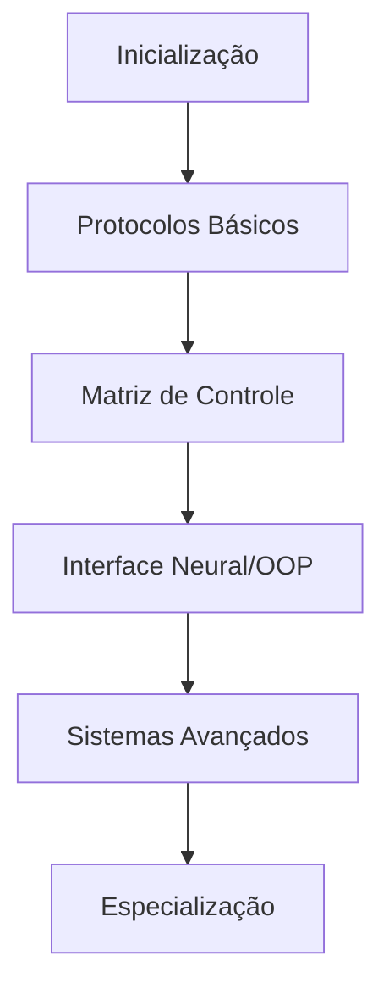

# NetRunner: Java Mastery Guide

```ascii
 _   _      _   ____                            
| \ | | ___| |_|  _ \ _   _ _ __  _ __   ___ _ __ 
|  \| |/ _ \ __| |_) | | | | '_ \| '_ \ / _ \ '__|
| |\  |  __/ |_|  _ <| |_| | | | | | | |  __/ |   
|_| \_|\___|\__|_| \_\\__,_|_| |_|_| |_|\___|_|   
```

## Sobre o Projeto

Bem-vindo ao submundo digital do Java. Este não é apenas mais um tutorial - é sua interface neural para mergulhar no universo da programação orientada a objetos em um ambiente cyberpunk. Aqui, bytes se transformam em realidade, e o código é sua arma para hackear o sistema.

## Filosofia do Projeto

Este guia foi projetado para:
- Transmitir conhecimento de forma direta e impactante
- Mesclar teoria com exemplos práticos do mundo real
- Criar uma experiência imersiva de aprendizado
- Explicar conceitos complexos com analogias cyberpunk
- Fornecer projetos práticos para consolidação do conhecimento

## Estrutura do Conteúdo

```ascii
NETRUNNER
├── [01] INICIALIZAÇÃO
│   ├── Interface Neural (Introdução)
│   └── Configuração do Sistema (Setup)
│
├── [02] PROTOCOLOS BÁSICOS
│   ├── Sintaxe Core
│   └── Estruturas Fundamentais
│
├── [03] MATRIZ DE CONTROLE
│   ├── Estruturas de Controle
│   └── Loops e Iterações
│
├── [04] INTERFACE NEURAL
│   ├── Programação Orientada a Objetos
│   └── Padrões de Design
│
└── [05] SISTEMAS AVANÇADOS
    ├── Frameworks
    └── Projetos Práticos
```

## Como Usar

1. Clone este repositório:
```bash
git clone https://github.com/seu-usuario/netrunner-java.git
```

2. Navegue pelos módulos em ordem
3. Execute os exemplos de código
4. Complete as missões (exercícios práticos)
5. Construa seus próprios sistemas

## Público-Alvo

- Iniciantes em programação
- Desenvolvedores migrando de outras linguagens
- Hackers em busca de conhecimento estruturado
- Estudantes de computação

## Tecnologias Utilizadas

- Java JDK 17+
- Exemplos práticos em código puro
- Diagramas interativos
- Projetos práticos escaláveis

## Roadmap



## Contribuição

Hackers são bem-vindos para contribuir. Siga o protocolo:

1. Fork o repositório
2. Crie sua branch (`git checkout -b feature/NovaFeature`)
3. Commit suas alterações (`git commit -m 'Implementando NovaFeature'`)
4. Push para a branch (`git push origin feature/NovaFeature`)
5. Abra um Pull Request

## Status do Projeto

- Versão: 1.0
- Status: Em Desenvolvimento
- Java: 17+

## Aviso

Este não é apenas mais um tutorial. É uma imersão completa no universo Java, onde cada conceito é uma nova camada de realidade digital a ser explorada.

## Licença

Este projeto está sob a licença MIT. Veja o arquivo [LICENSE](LICENSE) para mais detalhes.

---

> "No mundo digital, conhecimento é mais que poder - é sobrevivência."
