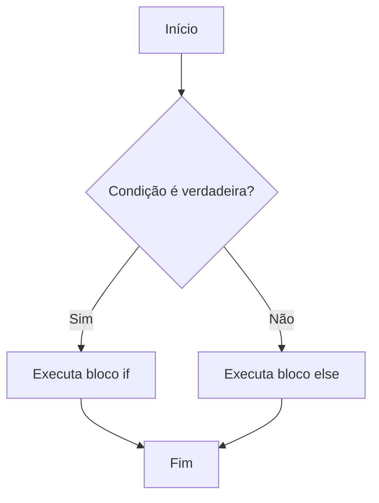
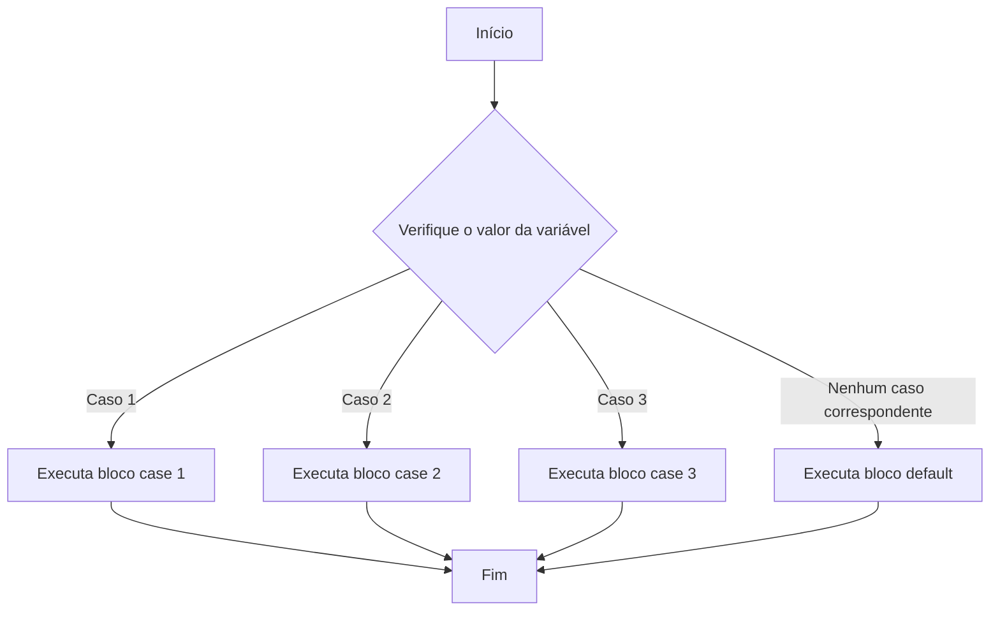
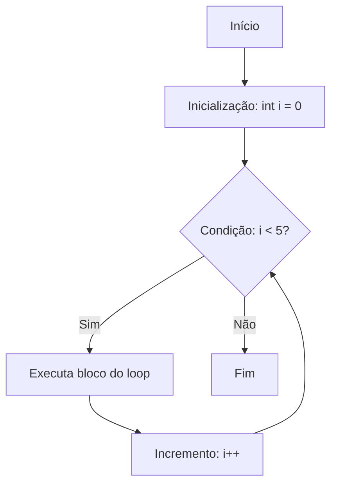
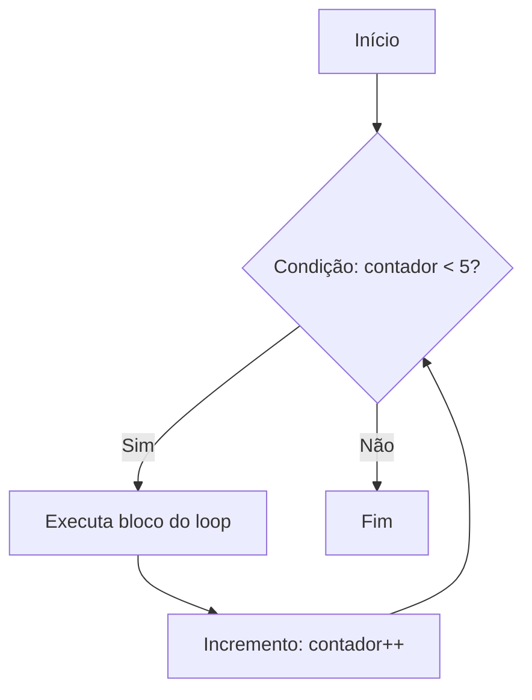
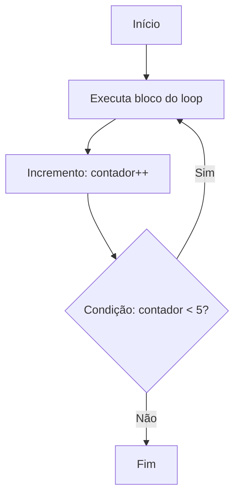

# 3. Estruturas de Controle

As estruturas de controle permitem que você tome decisões e repita blocos de código com base em condições específicas. Vamos explorar as principais: **condicionais** e **loops**.

---

## 3.1 Condicionais

As condicionais permitem que você execute diferentes blocos de código dependendo de uma condição.

### **if-else**
O `if-else` é usado para executar um bloco de código se uma condição for verdadeira e outro bloco se for falsa.


#### Fluxograma:



##### **Explicação do Flowchart:**
1. **Início:** O fluxo começa.
2. **Condição é verdadeira?:** Verifica se a condição do `if` é verdadeira.
   - Se **Sim**, o fluxo segue para o bloco `if`.
   - Se **Não**, o fluxo segue para o bloco `else`.
3. **Executa bloco if:** O código dentro do `if` é executado.
4. **Executa bloco else:** O código dentro do `else` é executado.
5. **Fim:** O fluxo termina.


### Sintaxe:
```java
int idade = 18;

if (idade >= 18) {
    System.out.println("Você é maior de idade.");
} else {
    System.out.println("Você é menor de idade.");
}
```

- **Exemplo com `else if`**:

```java
int nota = 85;

if (nota >= 90) {
    System.out.println("A");
} else if (nota >= 80) {
    System.out.println("B");
} else if (nota >= 70) {
    System.out.println("C");
} else {
    System.out.println("Reprovado");
}
```

- **`else if`:** Permite verificar múltiplas condições.
- **`if`:** Verifica a condição.
- **`else`:** Executa se a condição do `if` for falsa.


### **switch-case**
Aqui está o **Mermaid** para representar a estrutura do `switch-case`:

#### Fluxograma: {id="fluxograma_2"}



##### **Explicação do Flowchart:** {id="explica-o-do-flowchart_2"}
1. **Início:** O fluxo começa.
2. **Verifique o valor da variável:** O valor da variável é comparado com os casos (`case`).
   - Se o valor corresponder a **Caso 1**, o bloco `case 1` é executado.
   - Se o valor corresponder a **Caso 2**, o bloco `case 2` é executado.
   - Se o valor corresponder a **Caso 3**, o bloco `case 3` é executado.
   - Se **nenhum caso** for correspondido, o bloco `default` é executado.
3. **Executa bloco case/default:** O código dentro do `case` ou `default` é executado.
4. **Fim:** O fluxo termina.


#### Sintaxe {id="sintaxe_1"}

```java
int diaDaSemana = 3;

switch (diaDaSemana) {
    case 1:
        System.out.println("Domingo"); // Caso 1
        break;
    case 2:
        System.out.println("Segunda-feira"); // Caso 2
        break;
    case 3:
        System.out.println("Terça-feira"); // Caso 3
        break;
    default:
        System.out.println("Dia inválido"); // Default
}
``` 


## **3.2 Loops**

Os loops permitem que você repita um bloco de código várias vezes.


### **for**
O loop `for` é usado quando você sabe quantas vezes quer repetir o bloco de código.
Aqui está o **flowchart** em Mermaid para representar a estrutura do loop `for`:

#### Fluxograma: {id="fluxograma_1"}



##### **Explicação do Flowchart:** {id="explica-o-do-flowchart_1"}
1. **Início:** O fluxo começa.
2. **Inicialização (`int i = 0`):** A variável de controle é inicializada.
3. **Condição (`i < 5`):** Verifica se a condição para continuar o loop é verdadeira.
   - Se **Sim**, o fluxo segue para o bloco do loop.
   - Se **Não**, o fluxo termina.
4. **Executa bloco do loop:** O código dentro do loop é executado.
5. **Incremento (`i++`):** A variável de controle é atualizada.
6. **Fim:** O fluxo termina quando a condição não é mais atendida.

#### Sintaxe {id="sintaxe_2"}

```java
for (int i = 0; i < 5; i++) {
    System.out.println("Iteração: " + i);
}
```

##### **Passo a Passo do Fluxo:**
1. Inicializa `i` com `0`.
2. Verifica se `i < 5`:
   - Se verdadeiro, executa o bloco do loop e imprime `"Iteração: 0"`.
3. Incrementa `i` para `1`.
4. Verifica se `i < 5`:
   - Se verdadeiro, executa o bloco do loop e imprime `"Iteração: 1"`.
5. Repete o processo até que `i` seja `5`.
6. Quando `i` é `5`, a condição `i < 5` é falsa, e o loop termina.


<br>
<br>


### **while**
O loop `while` repete um bloco de código enquanto uma condição for verdadeira.

#### Fluxograma: {id="fluxograma_1_1"}




##### **Explicação do Flowchart:** {id="explica-o-do-flowchart_1_1"}
1. **Início:** O fluxo começa.
2. **Condição (`contador < 5`):** Verifica se a condição para continuar o loop é verdadeira.
   - Se **Sim**, o fluxo segue para o bloco do loop.
   - Se **Não**, o fluxo termina.
3. **Executa bloco do loop:** O código dentro do loop é executado.
4. **Incremento (`contador++`):** A variável de controle é atualizada.
5. **Fim:** O fluxo termina quando a condição não é mais atendida.

---

#### Sintaxe {id="sintaxe_2_1"}

```java
int contador = 0;

while (contador < 5) {
    System.out.println("Contador: " + contador);
    contador++;
}
```


##### **Passo a Passo do Fluxo:** {id="passo-a-passo-do-fluxo_1"}
1. Inicializa `contador` com `0`.
2. Verifica se `contador < 5`:
   - Se verdadeiro, executa o bloco do loop e imprime `"Contador: 0"`.
3. Incrementa `contador` para `1`.
4. Verifica se `contador < 5`:
   - Se verdadeiro, executa o bloco do loop e imprime `"Contador: 1"`.
5. Repete o processo até que `contador` seja `5`.
6. Quando `contador` é `5`, a condição `contador < 5` é falsa, e o loop termina.


<warning>

**Cuidado:**
- Se a condição nunca se tornar falsa (por exemplo, se você esquecer de incrementar `contador`), o loop será **infinito**.

</warning>


<br>
<br>


### **do-while**
O loop `do-while` é semelhante ao `while`, mas a condição é verificada **após** a execução do bloco de código.

#### Fluxograma: {id="fluxograma_1_2"}



---

##### **Explicação do Flowchart:** {id="explica-o-do-flowchart_1_2"}
1. **Início:** O fluxo começa.
2. **Executa bloco do loop:** O código dentro do loop é executado **pelo menos uma vez**.
3. **Incremento (`contador++`):** A variável de controle é atualizada.
4. **Condição (`contador < 5`):** Verifica se a condição para continuar o loop é verdadeira.
   - Se **Sim**, o fluxo retorna para executar o bloco do loop novamente.
   - Se **Não**, o fluxo termina.
5. **Fim:** O fluxo termina quando a condição não é mais atendida.


#### Sintaxe {id="sintaxe_2_2"}

```java
int contador = 0;

do {
    System.out.println("Contador: " + contador);
    contador++;
} while (contador < 5);
```

##### **Passo a Passo do Fluxo:** {id="passo-a-passo-do-fluxo_2"}
1. Inicializa `contador` com `0`.
2. Executa o bloco do loop e imprime `"Contador: 0"`.
3. Incrementa `contador` para `1`.
4. Verifica se `contador < 5`:
   - Se verdadeiro, executa o bloco do loop novamente e imprime `"Contador: 1"`.
5. Repete o processo até que `contador` seja `5`.
6. Quando `contador` é `5`, a condição `contador < 5` é falsa, e o loop termina.

<warning>

**Diferencial do `do-while`:**
- O bloco do loop é executado **pelo menos uma vez**, mesmo que a condição seja falsa desde o início.

</warning>


<br>
<br>
<br>


### **Exemplo Prático Combinado**

Exemplo que combina condicionais e loops:

```java
public class EstruturasControle {
    public static void main(String[] args) {
        // Exemplo de if-else
        int idade = 20;
        if (idade >= 18) {
            System.out.println("Você pode votar.");
        } else {
            System.out.println("Você não pode votar.");
        }

        // Exemplo de switch-case
        int dia = 3;
        switch (dia) {
            case 1:
                System.out.println("Domingo");
                break;
            case 2:
                System.out.println("Segunda");
                break;
            case 3:
                System.out.println("Terça");
                break;
            default:
                System.out.println("Dia inválido");
        }

        // Exemplo de for
        for (int i = 0; i < 3; i++) {
            System.out.println("For loop: " + i);
        }

        // Exemplo de while
        int contador = 0;
        while (contador < 3) {
            System.out.println("While loop: " + contador);
            contador++;
        }

        // Exemplo de do-while
        int contador2 = 0;
        do {
            System.out.println("Do-While loop: " + contador2);
            contador2++;
        } while (contador2 < 3);
    }
}
```

### **Próximos Passos**
Agora que você conhece as estruturas de controle, no próximo capítulo vamos explorar **orientação a objetos**, um dos pilares do Java.
