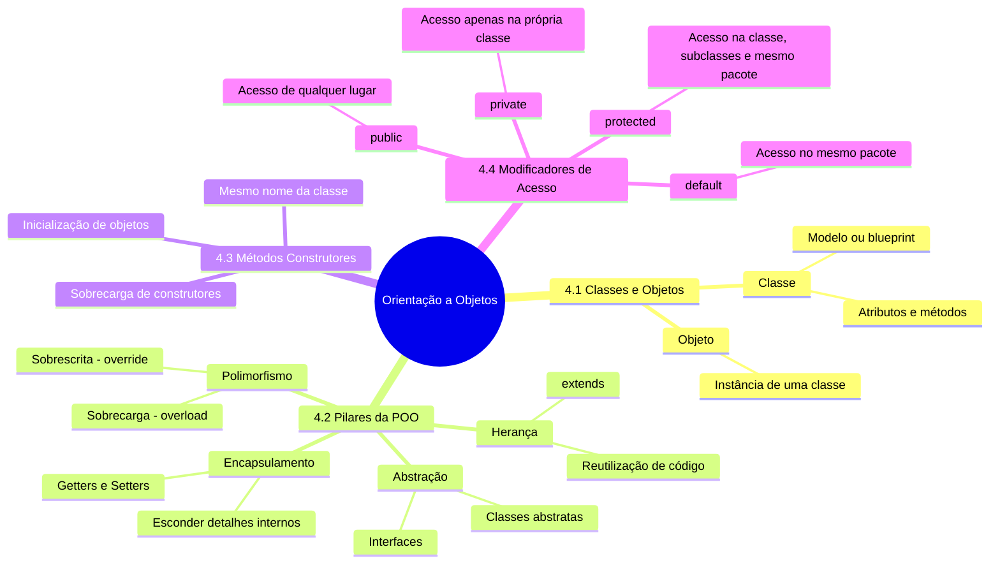

# 4. POO

## Diagrama



---

###  Orientação a Objetos (POO) com Minecraft

A Programação Orientada a Objetos (POO) pode ser comparada ao mundo de **Minecraft**, onde tudo é organizado em blocos, entidades e comportamentos. Vamos explorar os conceitos de POO usando exemplos do jogo.

---

#### **4.1 Classes e Objetos**

- **Classe:** Um modelo ou blueprint que define como algo deve ser. Em Minecraft, uma classe pode ser um tipo de bloco, como `BlocoDeMadeira` ou `BlocoDePedra`.
- **Objeto:** Uma instância específica de uma classe. Por exemplo, um bloco de madeira colocado no mundo é um **objeto** da classe `BlocoDeMadeira`.

##### Exemplo em Java:

```java
class Bloco {
    String tipo;
    int resistencia;

    void quebrar() {
        System.out.println("Bloco de " + tipo + " quebrado!");
    }
}

public class Main {
    public static void main(String[] args) {
        Bloco madeira = new Bloco(); // Objeto da classe Bloco
        madeira.tipo = "Madeira";
        madeira.resistencia = 10;
        madeira.quebrar(); // Saída: Bloco de Madeira quebrado!
    }
}
```

---

#### **4.2 Pilares da POO**

Vamos usar Minecraft para explicar os quatro pilares da POO:

1. **Encapsulamento:**
   - Esconde os detalhes internos de um bloco ou entidade. Por exemplo, você não precisa saber como um bloco de redstone funciona internamente para usá-lo.
   - Em Java, usamos **modificadores de acesso** (`private`, `public`, etc.) para encapsular.

   ```java
   class Bloco {
       private String tipo; // Atributo privado

       // Getter
       public String getTipo() {
           return tipo;
       }

       // Setter
       public void setTipo(String tipo) {
           this.tipo = tipo;
       }
   }
   ```

2. **Herança:**
   - Em Minecraft, blocos como `BlocoDeMadeira` e `BlocoDePedra` podem herdar características de uma classe base `Bloco`.
   - Em Java, usamos a palavra-chave `extends`.

   ```java
   class Bloco {
       String tipo;
       int resistencia;
   }

   class BlocoDeMadeira extends Bloco { // Herança
       BlocoDeMadeira() {
           tipo = "Madeira";
           resistencia = 10;
       }
   }
   ```

3. **Polimorfismo:**
   - Um mesmo método pode se comportar de formas diferentes. Por exemplo, o método `quebrar()` pode funcionar de maneira diferente para um bloco de madeira e um bloco de pedra.
   - Em Java, isso é feito com **sobrescrita de métodos** (`@Override`).

   ```java
   class Bloco {
       void quebrar() {
           System.out.println("Bloco genérico quebrado!");
       }
   }

   class BlocoDeMadeira extends Bloco {
       @Override
       void quebrar() { // Sobrescrita de método
           System.out.println("Bloco de Madeira quebrado!");
       }
   }
   ```

4. **Abstração:**
   - Simplifica objetos complexos. Em Minecraft, você não precisa saber como um bloco de redstone é programado para usá-lo em um circuito.
   - Em Java, usamos **classes abstratas** ou **interfaces**.

   ```java
   abstract class Bloco { // Classe abstrata
       abstract void quebrar(); // Método abstrato
   }

   class BlocoDeMadeira extends Bloco {
       @Override
       void quebrar() {
           System.out.println("Bloco de Madeira quebrado!");
       }
   }
   ```

---

#### **4.3 Métodos Construtores**

- **Construtor:** Um método especial usado para criar e inicializar objetos. Em Minecraft, quando você coloca um bloco no mundo, ele é "construído" com certas propriedades.
- Em Java, o construtor tem o mesmo nome da classe.

##### Exemplo:

```java
class Bloco {
    String tipo;
    int resistencia;

    // Construtor
    Bloco(String tipo, int resistencia) {
        this.tipo = tipo;
        this.resistencia = resistencia;
    }

    void quebrar() {
        System.out.println("Bloco de " + tipo + " quebrado!");
    }
}

public class Main {
    public static void main(String[] args) {
        Bloco madeira = new Bloco("Madeira", 10); // Usando o construtor
        madeira.quebrar(); // Saída: Bloco de Madeira quebrado!
    }
}
```

---

#### **4.4 Modificadores de Acesso**

Os modificadores de acesso controlam quem pode interagir com os atributos e métodos de uma classe. Em Minecraft, pense nisso como:

- **`public`:** Qualquer jogador pode interagir (como um bloco de grama).
- **`private`:** Apenas o jogo pode interagir (como a lógica interna de um bloco de redstone).
- **`protected`:** Apenas jogadores do mesmo time ou o jogo podem interagir (como um baú protegido).

##### Exemplo: {id="exemplo_1"}

```java
class Bloco {
    public String tipo; // Qualquer um pode acessar
    private int resistencia; // Apenas a classe pode acessar

    // Getter para resistência
    public int getResistencia() {
        return resistencia;
    }
}
```

---

### **Exemplo Prático Combinado**

Aqui está um exemplo que combina todos os conceitos usando Minecraft:

```java
// Classe abstrata para blocos
abstract class Bloco {
    protected String tipo;

    // Construtor
    public Bloco(String tipo) {
        this.tipo = tipo;
    }

    // Método abstrato
    abstract void quebrar();
}

// Classe para blocos de madeira
class BlocoDeMadeira extends Bloco {
    private int resistencia;

    // Construtor
    public BlocoDeMadeira(String tipo, int resistencia) {
        super(tipo); // Chama o construtor da classe pai
        this.resistencia = resistencia;
    }

    // Sobrescrita de método
    @Override
    void quebrar() {
        System.out.println("Bloco de " + tipo + " quebrado! Resistência: " + resistencia);
    }
}

public class Main {
    public static void main(String[] args) {
        BlocoDeMadeira madeira = new BlocoDeMadeira("Madeira", 10);
        madeira.quebrar(); // Saída: Bloco de Madeira quebrado! Resistência: 10
    }
}
```


### **Próximos Passos**
No próximo capítulo, vamos explorar **coleções e estruturas de dados**, como listas e mapas, que podem ser comparados aos inventários e baús de Minecraft.

