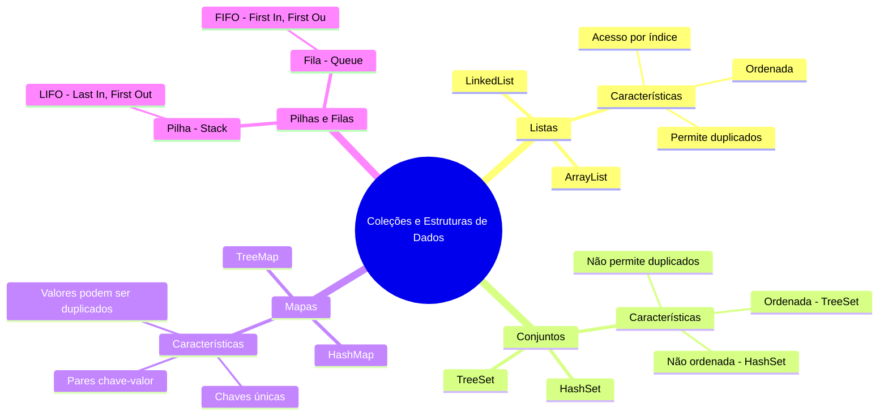

# 5. Estruturas de Dados

Em Minecraft, você tem **inventários**, **baús** e **estruturas de armazenamento** para guardar itens. Em Java, as coleções funcionam de maneira semelhante, permitindo que você armazene e manipule grupos de objetos de forma eficiente.





---

#### **5.1 Listas**

- **O que é uma lista?**
  - Uma coleção ordenada que permite elementos duplicados.
  - Em Minecraft, pense em uma lista como o seu **inventário**, onde você pode guardar vários itens, incluindo repetidos.

- **Implementação em Java:**
  - A interface `List` é implementada por classes como `ArrayList` e `LinkedList`.

##### Exemplo:

```java
import java.util.ArrayList;
import java.util.List;

public class Main {
    public static void main(String[] args) {
        // Criando uma lista de itens do inventário
        List<String> inventario = new ArrayList<>();

        // Adicionando itens
        inventario.add("Espada de Diamante");
        inventario.add("Picareta de Ferro");
        inventario.add("Maçã");
        inventario.add("Espada de Diamante"); // Itens duplicados são permitidos

        // Acessando itens
        System.out.println("Primeiro item: " + inventario.get(0)); // Saída: Espada de Diamante

        // Removendo um item
        inventario.remove("Maçã");

        // Verificando o tamanho do inventário
        System.out.println("Tamanho do inventário: " + inventario.size()); // Saída: 3
    }
}
```

---

#### **5.2 Conjuntos**

- **O que é um conjunto?**
  - Uma coleção que **não permite elementos duplicados**.
  - Em Minecraft, pense em um conjunto como um **baú de recursos únicos**, onde você não pode ter dois blocos de diamante com o mesmo ID.

- **Implementação em Java:**
  - A interface `Set` é implementada por classes como `HashSet` e `TreeSet`.

##### Exemplo:

```java
import java.util.HashSet;
import java.util.Set;

public class Main {
    public static void main(String[] args) {
        // Criando um conjunto de recursos únicos
        Set<String> recursos = new HashSet<>();

        // Adicionando recursos
        recursos.add("Diamante");
        recursos.add("Ferro");
        recursos.add("Ouro");
        recursos.add("Diamante"); // Duplicado não será adicionado

        // Verificando se um recurso existe
        System.out.println("Tem Diamante? " + recursos.contains("Diamante")); // Saída: true

        // Removendo um recurso
        recursos.remove("Ferro");

        // Tamanho do conjunto
        System.out.println("Quantidade de recursos únicos: " + recursos.size()); // Saída: 2
    }
}
```

---

#### **5.3 Mapas**

- **O que é um mapa?**
  - Uma coleção que armazena pares **chave-valor**.
  - Em Minecraft, pense em um mapa como um **sistema de coordenadas**, onde cada chave é uma coordenada (x, y, z) e o valor é o bloco naquela posição.

- **Implementação em Java:**
  - A interface `Map` é implementada por classes como `HashMap` e `TreeMap`.

##### Exemplo:

```java
import java.util.HashMap;
import java.util.Map;

public class Main {
    public static void main(String[] args) {
        // Criando um mapa de coordenadas e blocos
        Map<String, String> mundo = new HashMap<>();

        // Adicionando blocos ao mapa
        mundo.put("0,0,0", "Pedra");
        mundo.put("0,1,0", "Grama");
        mundo.put("1,0,0", "Areia");

        // Acessando um bloco
        System.out.println("Bloco em (0,1,0): " + mundo.get("0,1,0")); // Saída: Grama

        // Verificando se uma coordenada existe
        System.out.println("Tem bloco em (2,0,0)? " + mundo.containsKey("2,0,0")); // Saída: false

        // Removendo um bloco
        mundo.remove("0,0,0");

        // Tamanho do mapa
        System.out.println("Quantidade de blocos no mapa: " + mundo.size()); // Saída: 2
    }
}
```

---

#### **5.4 Pilhas e Filas**

- **Pilha (Stack):**
  - Uma coleção que segue o princípio **LIFO** (Last In, First Out).
  - Em Minecraft, pense em uma pilha como uma **pilha de blocos** que você coloca e remove do topo.

- **Fila (Queue):**
  - Uma coleção que segue o princípio **FIFO** (First In, First Out).
  - Em Minecraft, pense em uma fila como um **sistema de crafting**, onde o primeiro item que entra é o primeiro a ser processado.

##### Exemplo de Pilha:

```java
import java.util.Stack;

public class Main {
    public static void main(String[] args) {
        // Criando uma pilha de blocos
        Stack<String> pilhaDeBlocos = new Stack<>();

        // Adicionando blocos à pilha
        pilhaDeBlocos.push("Pedra");
        pilhaDeBlocos.push("Madeira");
        pilhaDeBlocos.push("Areia");

        // Removendo o bloco do topo
        System.out.println("Bloco removido: " + pilhaDeBlocos.pop()); // Saída: Areia
    }
}
```

##### Exemplo de Fila:

```java
import java.util.LinkedList;
import java.util.Queue;

public class Main {
    public static void main(String[] args) {
        // Criando uma fila de itens para craftar
        Queue<String> filaDeCraft = new LinkedList<>();

        // Adicionando itens à fila
        filaDeCraft.add("Madeira");
        filaDeCraft.add("Ferro");
        filaDeCraft.add("Diamante");

        // Processando o primeiro item da fila
        System.out.println("Item craftado: " + filaDeCraft.poll()); // Saída: Madeira
    }
}
```

---

### **Exemplo Prático Combinado**

Aqui está um exemplo que combina listas, conjuntos e mapas:

```java
import java.util.*;

public class Main {
    public static void main(String[] args) {
        // Lista de itens do inventário
        List<String> inventario = new ArrayList<>();
        inventario.add("Espada");
        inventario.add("Picareta");
        inventario.add("Maçã");

        // Conjunto de recursos únicos
        Set<String> recursos = new HashSet<>();
        recursos.add("Diamante");
        recursos.add("Ferro");

        // Mapa de coordenadas e blocos
        Map<String, String> mundo = new HashMap<>();
        mundo.put("0,0,0", "Pedra");
        mundo.put("0,1,0", "Grama");

        // Exibindo informações
        System.out.println("Inventário: " + inventario);
        System.out.println("Recursos únicos: " + recursos);
        System.out.println("Bloco em (0,1,0): " + mundo.get("0,1,0"));
    }
}
```

---

### **Próximos Passos**
No próximo capítulo, vamos explorar **tratamento de exceções**, que é como lidar com "erros" no mundo de Minecraft, como quando você tenta minerar um bloco sem a ferramenta certa.
