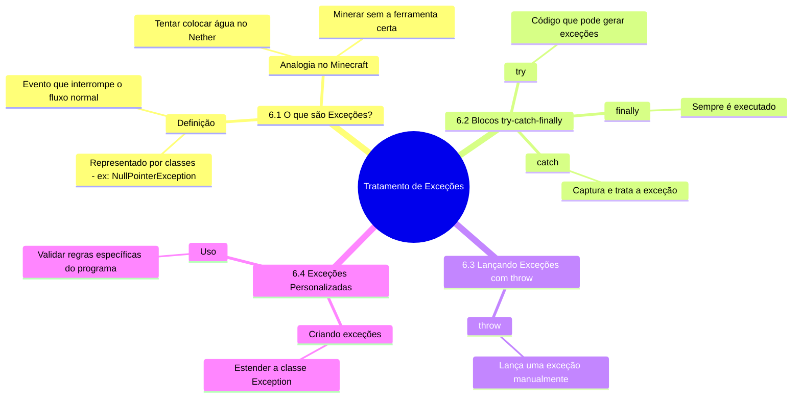
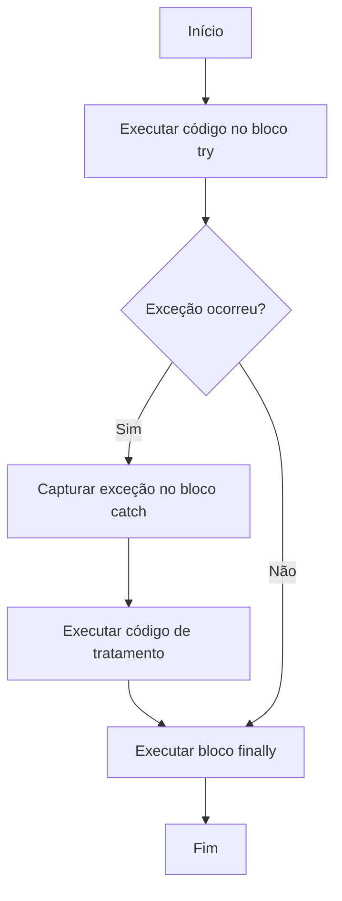

# 6. Tratamento de Exceções





Em Minecraft, às vezes coisas dão errado: você tenta minerar um bloco de diamante sem uma picareta de ferro, ou tenta construir em um lugar onde não há espaço. Em Java, essas situações são representadas por **exceções**, que são erros que ocorrem durante a execução do programa. O tratamento de exceções permite que você lide com esses erros de forma controlada.

---

## **6.1 O que são Exceções?**

- **Exceção:** Um evento que interrompe o fluxo normal de execução do programa.
- Em Minecraft, pense em uma exceção como tentar colocar água no Nether (não funciona, e o jogo "lança uma exceção").
- Em Java, exceções são representadas por classes, como `NullPointerException`, `ArrayIndexOutOfBoundsException`, etc.

---

## **6.2 Blocos try-catch-finally**

- **`try`:** Bloco onde você coloca o código que pode gerar uma exceção.
- **`catch`:** Bloco que captura e trata a exceção.
- **`finally`:** Bloco que sempre é executado, independentemente de uma exceção ter ocorrido ou não.

### Exemplo: {id="exemplo_1_1"}



```java
public class Main {
    public static void main(String[] args) {
        try {
            // Código que pode gerar uma exceção
            int[] blocos = new int[3];
            System.out.println(blocos[5]); // Acesso inválido ao array
        } catch (ArrayIndexOutOfBoundsException e) {
            // Tratamento da exceção
            System.out.println("Erro: Você tentou acessar um bloco que não existe!");
        } finally {
            // Bloco que sempre é executado
            System.out.println("Finalizando mineração...");
        }
    }
}
```

**Saída:**
```
Erro: Você tentou acessar um bloco que não existe!
Finalizando mineração...
```

---

## **6.3 Lançando Exceções com `throw`**

- **`throw`:** Permite que você lance uma exceção manualmente.
- Útil para validar condições específicas no seu código.

### Exemplo:

```java
public class Main {
    public static void main(String[] args) {
        try {
            minerarBloco("Diamante"); // Tenta minerar um bloco de diamante
        } catch (Exception e) {
            System.out.println(e.getMessage()); // Exibe a mensagem de erro
        }
    }

    static void minerarBloco(String bloco) throws Exception {
        if (!bloco.equals("Pedra")) {
            throw new Exception("Erro: Você precisa de uma picareta para minerar " + bloco + "!");
        }
        System.out.println("Bloco de " + bloco + " minerado com sucesso!");
    }
}
```

**Saída:**
```
Erro: Você precisa de uma picareta para minerar Diamante!
```

---

## **6.4 Criando Exceções Personalizadas**

- Você pode criar suas próprias exceções para representar erros específicos do seu programa.
- Em Minecraft, pense em uma exceção personalizada como "BlocoIncorretoException", que ocorre quando você tenta colocar um bloco onde não deveria.

### Exemplo: {id="exemplo_1"}

```java
// Criando uma exceção personalizada
class BlocoIncorretoException extends Exception {
    public BlocoIncorretoException(String mensagem) {
        super(mensagem);
    }
}

public class Main {
    public static void main(String[] args) {
        try {
            colocarBloco("Água", "Nether"); // Tenta colocar água no Nether
        } catch (BlocoIncorretoException e) {
            System.out.println(e.getMessage()); // Exibe a mensagem de erro
        }
    }

    static void colocarBloco(String bloco, String dimensao) throws BlocoIncorretoException {
        if (bloco.equals("Água") && dimensao.equals("Nether")) {
            throw new BlocoIncorretoException("Erro: Água não pode ser colocada no Nether!");
        }
        System.out.println("Bloco de " + bloco + " colocado com sucesso na dimensão " + dimensao + "!");
    }
}
```

**Saída:**
```
Erro: Água não pode ser colocada no Nether!
```

---

## **Exemplo Prático Combinado**

Aqui está um exemplo que combina tudo o que vimos até agora:

```java
public class Main {
    public static void main(String[] args) {
        try {
            // Tenta minerar um bloco de diamante
            minerarBloco("Diamante");
        } catch (Exception e) {
            System.out.println(e.getMessage()); // Exibe a mensagem de erro
        } finally {
            System.out.println("Finalizando mineração...");
        }
    }

    static void minerarBloco(String bloco) throws Exception {
        if (!bloco.equals("Pedra")) {
            throw new Exception("Erro: Você precisa de uma picareta para minerar " + bloco + "!");
        }
        System.out.println("Bloco de " + bloco + " minerado com sucesso!");
    }
}
```

**Saída:**
```
Erro: Você precisa de uma picareta para minerar Diamante!
Finalizando mineração...
```

---

## **Próximos Passos**
No próximo capítulo, vamos explorar **arquivos e I/O**, que é como salvar e carregar dados no mundo de Minecraft (ou no seu programa Java).
