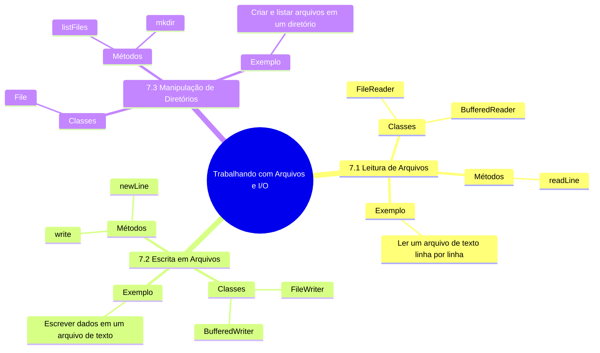

# 7. Trabalho com Arquivos de I/O

Em Minecraft, você pode salvar e carregar mundos, inventários e configurações em arquivos. Em Java, o processo é semelhante: **você pode ler e escrever dados** em arquivos para persistir informações. Vamos ver como fazer isso!





---

## **7.1 Leitura de Arquivos**

- **O que é leitura de arquivos?**
  - Processo de acessar e extrair dados de um arquivo.
  - Em Minecraft, pense em carregar um mundo salvo.

- **Como fazer em Java:**
  - Use classes como `FileReader` e `BufferedReader` para ler arquivos de texto.

### Exemplo: {id="exemplo_2"}

```java
import java.io.BufferedReader;
import java.io.FileReader;
import java.io.IOException;

public class Main {
    public static void main(String[] args) {
        // Caminho do arquivo
        String caminho = "mundos/mundo1.txt";

        try (BufferedReader br = new BufferedReader(new FileReader(caminho))) {
            String linha;
            while ((linha = br.readLine()) != null) {
                System.out.println(linha); // Exibe cada linha do arquivo
            }
        } catch (IOException e) {
            System.out.println("Erro ao ler o arquivo: " + e.getMessage());
        }
    }
}
```

---

## **7.2 Escrita em Arquivos**

- **O que é escrita em arquivos?**
  - Processo de salvar dados em um arquivo.
  - Em Minecraft, pense em salvar um mundo ou inventário.

- **Como fazer em Java:**
  - Use classes como `FileWriter` e `BufferedWriter` para escrever em arquivos de texto.

### Exemplo: {id="exemplo_1"}

```java
import java.io.BufferedWriter;
import java.io.FileWriter;
import java.io.IOException;

public class Main {
    public static void main(String[] args) {
        // Caminho do arquivo
        String caminho = "mundos/mundo1.txt";

        try (BufferedWriter bw = new BufferedWriter(new FileWriter(caminho))) {
            bw.write("Bloco de Pedra na posição (0,0,0)");
            bw.newLine(); // Nova linha
            bw.write("Bloco de Madeira na posição (1,1,1)");
            System.out.println("Dados salvos com sucesso!");
        } catch (IOException e) {
            System.out.println("Erro ao escrever no arquivo: " + e.getMessage());
        }
    }
}
```

---

## **7.3 Manipulação de Diretórios**

- **O que é manipulação de diretórios?**
  - Criar, listar ou excluir pastas e arquivos.
  - Em Minecraft, pense em organizar seus mundos em pastas.

- **Como fazer em Java:**
  - Use a classe `File` para manipular diretórios e arquivos.

### Exemplo:

```java
import java.io.File;

public class Main {
    public static void main(String[] args) {
        // Criando um diretório
        File diretorio = new File("mundos");
        if (diretorio.mkdir()) {
            System.out.println("Diretório criado com sucesso!");
        } else {
            System.out.println("Diretório já existe ou não pôde ser criado.");
        }

        // Listando arquivos no diretório
        File[] arquivos = diretorio.listFiles();
        if (arquivos != null) {
            for (File arquivo : arquivos) {
                System.out.println(arquivo.getName()); // Exibe o nome de cada arquivo
            }
        }
    }
}
```

---

## **Exemplo Prático Combinado**

Aqui está um exemplo que combina leitura, escrita e manipulação de diretórios:

```java
import java.io.*;
import java.util.Scanner;

public class Main {
    public static void main(String[] args) {
        // Criando um diretório
        File diretorio = new File("mundos");
        if (!diretorio.exists()) {
            diretorio.mkdir();
        }

        // Escrevendo em um arquivo
        String caminho = diretorio.getPath() + "/mundo1.txt";
        try (BufferedWriter bw = new BufferedWriter(new FileWriter(caminho))) {
            bw.write("Bloco de Pedra na posição (0,0,0)");
            bw.newLine();
            bw.write("Bloco de Madeira na posição (1,1,1)");
            System.out.println("Dados salvos com sucesso!");
        } catch (IOException e) {
            System.out.println("Erro ao escrever no arquivo: " + e.getMessage());
        }

        // Lendo o arquivo
        try (BufferedReader br = new BufferedReader(new FileReader(caminho))) {
            String linha;
            System.out.println("Conteúdo do arquivo:");
            while ((linha = br.readLine()) != null) {
                System.out.println(linha);
            }
        } catch (IOException e) {
            System.out.println("Erro ao ler o arquivo: " + e.getMessage());
        }
    }
}
```

---

### **Próximos Passos**
No próximo capítulo, vamos explorar **conceitos avançados**, como interfaces, genéricos e expressões lambda, que são ferramentas poderosas para tornar seu código mais flexível e reutilizável.
