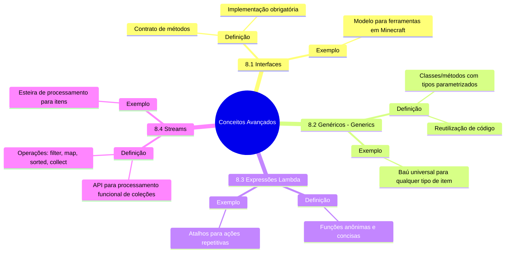

#  8. Conceitos Avançados

Neste capítulo, vamos mergulhar em recursos avançados do Java que permitem criar código mais poderoso e expressivo. Esses conceitos são como "encantamentos" no Minecraft: eles melhoram e ampliam as capacidades do seu código.





---

## **8.1 Interfaces**

- **O que são interfaces?**
  - Uma interface é um contrato que define um conjunto de métodos que uma classe deve implementar.
  - Em Minecraft, pense em uma interface como um "modelo" para ferramentas. Por exemplo, todas as ferramentas (picaretas, machados, etc.) devem ter um método `usar()`.

- **Como usar em Java:**
  - Use a palavra-chave `interface` para definir uma interface.
  - Classes que implementam uma interface devem fornecer implementações para todos os seus métodos.

### Exemplo:

```java
interface Ferramenta {
    void usar();
}

class Picareta implements Ferramenta {
    @Override
    public void usar() {
        System.out.println("Mineração em andamento...");
    }
}

public class Main {
    public static void main(String[] args) {
        Ferramenta minhaPicareta = new Picareta();
        minhaPicareta.usar(); // Saída: Mineração em andamento...
    }
}
```

---

## **8.2 Genéricos (Generics)**

- **O que são genéricos?**
  - Genéricos permitem que você crie classes, interfaces e métodos que funcionam com qualquer tipo de dado.
  - Em Minecraft, pense em genéricos como um "baú universal" que pode armazenar qualquer tipo de item.

- **Como usar em Java:**
  - Use `<T>` para definir um tipo genérico.

### Exemplo: {id="exemplo_1"}

```java
class Bau<T> {
    private T item;

    public void guardar(T item) {
        this.item = item;
    }

    public T pegar() {
        return item;
    }
}

public class Main {
    public static void main(String[] args) {
        Bau<String> bauDeItens = new Bau<>();
        bauDeItens.guardar("Diamante");
        System.out.println("Item no baú: " + bauDeItens.pegar()); // Saída: Item no baú: Diamante
    }
}
```

---

## **8.3 Expressões Lambda**

- **O que são expressões lambda?**
  - São uma forma concisa de representar métodos anônimos (funções sem nome).
  - Em Minecraft, pense em expressões lambda como "atalhos" para ações repetitivas, como minerar blocos ou plantar sementes.

- **Como usar em Java:**
  - Use a sintaxe `(parâmetros) -> { corpo }`.

### Exemplo: {id="exemplo_3"}

```java
import java.util.ArrayList;
import java.util.List;

public class Main {
    public static void main(String[] args) {
        List<String> itens = new ArrayList<>();
        itens.add("Diamante");
        itens.add("Ferro");
        itens.add("Ouro");

        // Usando lambda para iterar sobre a lista
        itens.forEach(item -> System.out.println("Item: " + item));
    }
}
```

**Saída:**
```
Item: Diamante
Item: Ferro
Item: Ouro
```

---

## **8.4 Streams**

- **O que são streams?**
  - Streams são uma API poderosa para processar coleções de dados de forma funcional.
  - Em Minecraft, pense em streams como uma "esteira de processamento" para itens, onde você pode filtrar, ordenar e transformar blocos.

- **Como usar em Java:**
  - Use métodos como `filter`, `map`, `sorted` e `collect` para manipular dados.

### Exemplo: {id="exemplo_2"}

```java
import java.util.Arrays;
import java.util.List;
import java.util.stream.Collectors;

public class Main {
    public static void main(String[] args) {
        List<String> itens = Arrays.asList("Diamante", "Ferro", "Ouro", "Pedra");

        // Filtrar itens que começam com 'D' e transformar em maiúsculas
        List<String> resultado = itens.stream()
            .filter(item -> item.startsWith("D"))
            .map(String::toUpperCase)
            .collect(Collectors.toList());

        System.out.println(resultado); // Saída: [DIAMANTE]
    }
}
```

---

### **Exemplo Prático Combinado**

Aqui está um exemplo que combina interfaces, genéricos, expressões lambda e streams:

```java
import java.util.Arrays;
import java.util.List;
import java.util.stream.Collectors;

interface Ferramenta {
    void usar();
}

class Picareta implements Ferramenta {
    @Override
    public void usar() {
        System.out.println("Mineração em andamento...");
    }
}

class Bau<T> {
    private T item;

    public void guardar(T item) {
        this.item = item;
    }

    public T pegar() {
        return item;
    }
}

public class Main {
    public static void main(String[] args) {
        // Usando interfaces
        Ferramenta minhaPicareta = new Picareta();
        minhaPicareta.usar(); // Saída: Mineração em andamento...

        // Usando genéricos
        Bau<String> bauDeItens = new Bau<>();
        bauDeItens.guardar("Diamante");
        System.out.println("Item no baú: " + bauDeItens.pegar()); // Saída: Item no baú: Diamante

        // Usando streams e lambda
        List<String> itens = Arrays.asList("Diamante", "Ferro", "Ouro", "Pedra");
        List<String> resultado = itens.stream()
            .filter(item -> item.startsWith("D"))
            .map(String::toUpperCase)
            .collect(Collectors.toList());

        System.out.println(resultado); // Saída: [DIAMANTE]
    }
}
```

---

## **Próximos Passos**
No próximo capítulo, vamos explorar **multithreading e concorrência**, que são como "jogar Minecraft com várias tarefas ao mesmo tempo".
