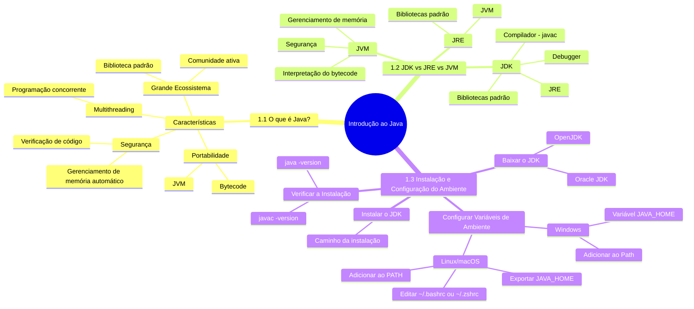
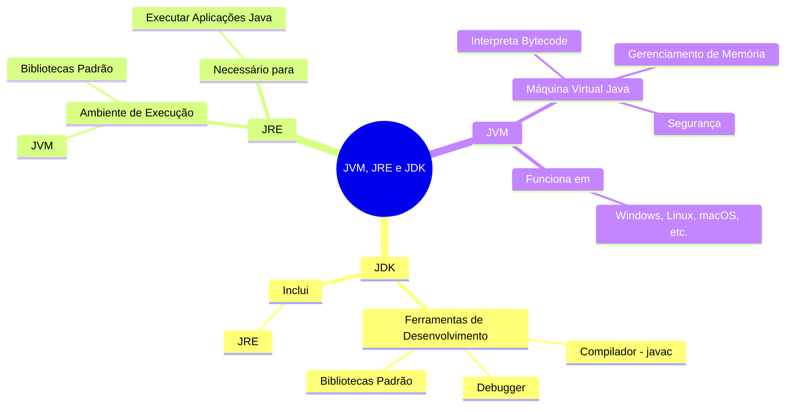
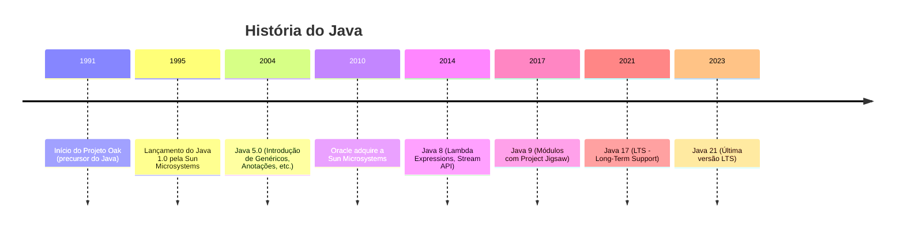

# 1. Introdução ao Java

Java é uma das linguagens de programação mais populares e versáteis do mundo. Criada na década de 1990 pela Sun Microsystems (hoje pertencente à Oracle), Java é amplamente usada para desenvolver aplicações desktop, web, mobile (Android) e até sistemas embarcados. 

Sua filosofia **"write once, run anywhere"** (escreva uma vez, execute em qualquer lugar) faz com que programas escritos em Java possam rodar em qualquer dispositivo que tenha uma **JVM** (Java Virtual Machine).


## **1.1 O que é Java?**
Java é uma linguagem de programação **orientada a objetos** e de **alto nível**, o que significa que ela é projetada para ser fácil de ler e escrever. Aqui estão algumas características que tornam Java especial:

- **Portabilidade:** O código Java é compilado para um formato chamado **bytecode**, que pode ser executado em qualquer dispositivo com uma JVM.
- **Segurança:** Java possui mecanismos de segurança integrados, como o **gerenciamento de memória automático** (coleta de lixo) e verificação de código.
- **Multithreading:** Java suporta programação concorrente, permitindo que você crie aplicações que executam várias tarefas simultaneamente.
- **Grande Ecossistema:** Java tem uma vasta biblioteca padrão e uma comunidade ativa, o que facilita o desenvolvimento de aplicações complexas.





---

## **1.2 JDK vs JRE vs JVM**
Entender a diferença entre JDK, JRE e JVM é fundamental para trabalhar com Java:

- **JDK (Java Development Kit):**  
  É o kit de desenvolvimento completo. Ele inclui ferramentas para compilar, depurar e executar código Java. Se você quer **escrever** programas em Java, precisa do JDK.  
  - Contém: Compilador (`javac`), Debugger, JRE, e bibliotecas padrão.

- **JRE (Java Runtime Environment):**  
  É o ambiente de execução necessário para **rodar** aplicações Java. Se você só quer executar programas Java, o JRE é suficiente.  
  - Contém: JVM e bibliotecas padrão.

- **JVM (Java Virtual Machine):**  
  É a máquina virtual que executa o **bytecode** Java. Ela é responsável por garantir que o código Java funcione em qualquer plataforma (Windows, Linux, macOS, etc.).  
  - Funcionalidades: Interpretação do bytecode, gerenciamento de memória, segurança.

**Resumo:**  
- **JDK:** Para desenvolvedores que querem criar programas.  
- **JRE:** Para usuários que só querem executar programas.  
- **JVM:** O coração da portabilidade do Java.





### 1.2.1 Timeline do Java



## **1.3 Instalação e Configuração do Ambiente**
Para começar a programar em Java, você precisa instalar o JDK e configurar o ambiente. Siga os passos abaixo:

1. **Baixar o JDK:**
   - Acesse o site da Oracle ([Oracle JDK](https://www.oracle.com/java/technologies/javase-downloads.html)) ou use o OpenJDK ([OpenJDK](https://openjdk.org/)).
   - Escolha a versão adequada para o seu sistema operacional (Windows, macOS, Linux).

2. **Instalar o JDK:**
   - Execute o instalador e siga as instruções.
   - Anote o caminho onde o JDK foi instalado (ex: `C:\Program Files\Java\jdk-21`).

3. **Configurar Variáveis de Ambiente:**
   - **Windows:**
     1. Abra o Painel de Controle > Sistema e Segurança > Sistema > Configurações avançadas do sistema.
     2. Clique em "Variáveis de Ambiente".
     3. Na seção "Variáveis do Sistema", crie ou edite a variável `JAVA_HOME` com o caminho da instalação do JDK (ex: `C:\Program Files\Java\jdk-21`).
     4. Edite a variável `Path` e adicione `%JAVA_HOME%\bin`.
   - **Linux/macOS:**
     Adicione as seguintes linhas ao arquivo `~/.bashrc` ou `~/.zshrc`:
     ```bash
     export JAVA_HOME=/caminho/para/jdk
     export PATH=$JAVA_HOME/bin:$PATH
     ```

4. **Verificar a Instalação:**
   - Abra o terminal ou prompt de comando e digite:
     ```bash
     java -version
     javac -version
     ```
   - Se a instalação estiver correta, você verá a versão do Java e do compilador.

---

## **Próximos Passos**
Agora que você tem o ambiente configurado, está pronto para escrever seu primeiro programa em Java! No próximo capítulo, vamos explorar a **sintaxe básica** da linguagem e criar um "Hello, World!".

<note>

**Estrutura de um Programa Java**


Você está absolutamente certo! Vou criar um **terceiro Mermaid** que faça mais sentido e seja útil para o guia. Que tal um diagrama para explicar a **estrutura de um programa Java**? Isso pode ser mais prático e relevante. Aqui está:

---

### **3. Mermaid: Estrutura de um Programa Java**

```mermaid
flowchart TD
    A[Programa Java] --> B[Classe Principal]
    B --> C[Método Main]
    C --> D[Declaração de Variáveis]
    C --> E[Estruturas de Controle]
    C --> F[Chamada de Métodos]
    E --> G[Condicionais if-else]
    E --> H[Loops for/while]
    F --> I[Métodos Personalizados]
    I --> J[Parâmetros e Retorno]
    D --> K[Tipos de Dados]
    K --> L[Primitivos int, double, etc.]
    K --> M[Referência String, Arrays, etc.]
 ```

### **Explicação do Diagrama:**
1. **Programa Java:** Tudo começa com um programa Java.
2. **Classe Principal:** Todo programa Java precisa de uma classe principal.
3. **Método Main:** O ponto de entrada do programa é o método `main`.
4. **Declaração de Variáveis:** Dentro do `main`, variáveis são declaradas.
5. **Estruturas de Controle:** Condicionais (`if-else`) e loops (`for`, `while`) são usados para controlar o fluxo do programa.
6. **Chamada de Métodos:** Métodos personalizados podem ser chamados para organizar o código.
7. **Métodos Personalizados:** Métodos podem receber parâmetros e retornar valores.
8. **Tipos de Dados:** Variáveis podem ser de tipos primitivos (`int`, `double`, etc.) ou de referência (`String`, `Arrays`, etc.).

</note>
