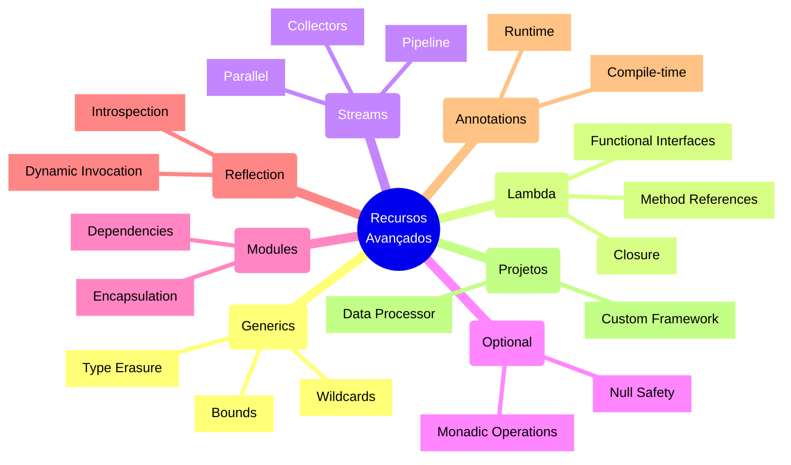

# Recursos Avançados do Java


## Visão Geral



## Recursos Principais

### Generics
Permite criar classes e métodos type-safe que podem trabalhar com diferentes tipos:

```java
public class Box<T> {
    private T content;
    
    public void set(T content) {
        this.content = content;
    }
    
    public T get() {
        return content;
    }
}
```

### Lambda Expressions
Implementa interfaces funcionais de forma concisa:

```java
List<String> names = Arrays.asList("Alice", "Bob", "Charlie");
names.forEach(name -> System.out.println("Hello, " + name));
```

### Streams API
Processa coleções de forma declarativa:

```java
List<Integer> numbers = Arrays.asList(1, 2, 3, 4, 5);
int sum = numbers.stream()
                .filter(n -> n % 2 == 0)
                .mapToInt(Integer::intValue)
                .sum();
```

### Optional
Lida com valores nulos de forma segura:

```java
Optional<String> optional = Optional.ofNullable(getValue());
String result = optional.map(String::toUpperCase)
                       .orElse("default");
```

### Sistema de Módulos
Encapsula e gerencia dependências:

```java
module com.example.app {
    requires java.base;
    requires java.sql;
    
    exports com.example.api;
}
```

### Reflection
Examina e manipula código em runtime:

```java
Class<?> clazz = MyClass.class;
Method method = clazz.getDeclaredMethod("myMethod");
method.invoke(instance);
```

### Annotations
Define metadados para código:

```java
@Target(ElementType.METHOD)
@Retention(RetentionPolicy.RUNTIME)
public @interface Transactional {
    boolean readOnly() default false;
}
```

## Aplicações Práticas

### Desenvolvimento de Frameworks
```java
@Controller
@RequestMapping("/api")
public class UserController {
    @Autowired
    private UserService service;
    
    @GetMapping("/{id}")
    public User getUser(@PathVariable Long id) {
        return service.findById(id);
    }
}
```

### Processamento de Dados
```java
public class DataProcessor<T> {
    public List<R> process(
        List<T> data,
        Predicate<T> filter,
        Function<T, R> transformer
    ) {
        return data.stream()
                  .filter(filter)
                  .map(transformer)
                  .collect(Collectors.toList());
    }
}
```

### Plugins Dinâmicos
```java
public class PluginLoader {
    public Plugin loadPlugin(String className) {
        Class<?> pluginClass = Class.forName(className);
        return (Plugin) pluginClass.getDeclaredConstructor()
                                 .newInstance();
    }
}
```

## Melhores Práticas

1. **Type Safety**
   - Use Generics apropriadamente
   - Evite raw types
   - Aplique bounds quando necessário

2. **Performance**
   - Use Streams paralelos com cautela
   - Cache resultados de reflection
   - Otimize operações lambda críticas

3. **Modularidade**
   - Defina interfaces claras
   - Encapsule implementações
   - Gerencie dependências explicitamente

## Próximos Passos

- [Generics](generics.md)
- [Lambda Expressions](lambda.md)
- [Streams API](streams.md)
- [Optional](optional.md)
- [Modules](modules.md)
- [Reflection](reflection.md)
- [Annotations](annotations.md)
- [Advanced Projects](advanced-projects.md)

## Recursos Adicionais

### Documentação Oficial
- [Java Language Specification](https://docs.oracle.com/javase/specs/)
- [JDK Documentation](https://docs.oracle.com/en/java/javase/)

### Ferramentas
- IDEs com suporte avançado
- Analisadores estáticos
- Frameworks de teste

### Comunidade
- Fóruns de discussão
- Repositórios de exemplo
- Blogs técnicos

## Desafios de Aprendizado

1. Implemente um framework de injeção de dependência
2. Crie um processador de anotações customizado
3. Desenvolva um container genérico thread-safe
4. Construa um sistema de plugins dinâmico

[Generics](generics.md){.next-step}