# Projetos Avançados

## Visão Geral

```mermaid
graph TD
    A[Projetos Avançados] --> B[Data Processor]
    A --> C[Functional Calculator]
    A --> D[Custom Framework]
    A --> E[Annotation Processor]
    A --> F[Generic Container]
    A --> G[Reflection Explorer]
    
    style A fill:#1a1a1a,stroke:#00ff00
    style B fill:#1a1a1a,stroke:#33ccff
    style C fill:#1a1a1a,stroke:#33ccff
    style D fill:#1a1a1a,stroke:#33ccff
    style E fill:#1a1a1a,stroke:#33ccff
    style F fill:#1a1a1a,stroke:#33ccff
    style G fill:#1a1a1a,stroke:#33ccff
```



## Estrutura Base dos Projetos

```ascii
PROJETO
├── src/
│   ├── main/
│   │   ├── java/
│   │   │   └── com/
│   │   │       └── netrunner/
│   │   │           └── project/
│   │   │               ├── annotations/
│   │   │               ├── processors/
│   │   │               ├── core/
│   │   │               └── util/
│   │   └── resources/
│   │       └── META-INF/
│   │           └── services/
│   └── test/
│       └── java/
└── pom.xml
```

## Data Processor

### Objetivo
Criar um sistema de processamento de dados com anotações personalizadas para validação, transformação e persistência.

### Características
- Anotações para validação de campos
- Transformadores de dados customizáveis
- Pipeline de processamento configurável
- Suporte a diferentes formatos de dados

### Exemplo de Implementação
```java
@Entity
@DataProcessor(version = "1.0")
public class UserData {
    @Validate(pattern = "^[A-Za-z0-9._%+-]+@[A-Za-z0-9.-]+\\.[A-Za-z]{2,6}$")
    private String email;
    
    @Transform(transformer = EncryptTransformer.class)
    private String password;
    
    @Persist(strategy = "JDBC")
    private UserProfile profile;
}
```

## Functional Calculator

### Objetivo
Implementar uma calculadora avançada usando programação funcional e expressões lambda.

### Características
- Operações encadeadas
- Histórico de operações
- Funções customizáveis
- Suporte a expressões complexas

### Exemplo de Implementação
```java
public class FunctionalCalculator {
    @Operation("SUM")
    public Function<Double, Double> sum(Double a) {
        return b -> a + b;
    }
    
    @Operation("COMPOSE")
    public <T, R> Function<T, R> compose(
        @OperationParam Function<T, R>... functions
    ) {
        return Arrays.stream(functions)
                    .reduce(Function.identity(), Function::andThen);
    }
}
```

## Custom Framework

### Objetivo
Desenvolver um mini-framework usando reflexão e anotações para injeção de dependências.

### Características
- Injeção de dependências
- Gerenciamento de ciclo de vida
- Configuração via anotações
- Suporte a plugins

### Exemplo de Implementação
```java
@Component
@Scope("singleton")
public class ServiceManager {
    @Inject
    private ConfigProvider config;
    
    @Initialize
    public void setup() {
        // Inicialização
    }
    
    @HandleRequest("/api")
    public Response processRequest(Request request) {
        // Processamento
    }
}
```

## Annotation Processor

### Objetivo
Criar um processador de anotações para geração de código em tempo de compilação.

### Características
- Geração de código
- Validação em tempo de compilação
- Documentação automática
- Templates customizáveis

### Exemplo de Implementação
```java
@SupportedAnnotationTypes("com.netrunner.annotations.*")
@SupportedSourceVersion(SourceVersion.RELEASE_17)
public class CustomAnnotationProcessor extends AbstractProcessor {
    @Override
    public boolean process(
        Set<? extends TypeElement> annotations,
        RoundEnvironment roundEnv
    ) {
        // Processamento das anotações
        return true;
    }
}
```

## Generic Container

### Objetivo
Implementar um container genérico com suporte a diferentes tipos de dados e operações.

### Características
- Tipos genéricos
- Operações type-safe
- Validações em tempo de compilação
- Conversões automáticas

### Exemplo de Implementação
```java
@Container
public class DataContainer<T extends Comparable<T>> {
    @Validate
    private List<T> elements;
    
    @Operation
    public <R> Optional<R> transform(
        @Transformer Function<T, R> transformer
    ) {
        // Transformação de dados
    }
}
```

## Reflection Explorer

### Objetivo
Criar uma ferramenta para exploração e manipulação de classes usando reflexão.

### Características
- Inspeção de classes
- Modificação em runtime
- Proxy dinâmico
- Carregamento de classes

### Exemplo de Implementação
```java
public class ReflectionExplorer {
    @Inspect
    public ClassInfo analyze(Class<?> target) {
        return ClassInfo.builder()
                       .methods(getMethods(target))
                       .fields(getFields(target))
                       .annotations(getAnnotations(target))
                       .build();
    }
    
    @Modify
    public Object enhance(
        @Target Object instance,
        @Enhancement Enhancement enhancement
    ) {
        // Modificação dinâmica
    }
}
```

## Desafios Extras

### Data Processor
- Implementar validação assíncrona
- Adicionar suporte a expressões regulares complexas
- Criar pipeline de transformação configurável
- Implementar persistência em diferentes bancos

### Functional Calculator
- Adicionar suporte a operações matemáticas avançadas
- Implementar sistema de plugins para novas operações
- Criar DSL para expressões matemáticas
- Adicionar suporte a cálculos paralelos

### Custom Framework
- Implementar hot reload de componentes
- Adicionar suporte a aspectos
- Criar sistema de plugins dinâmicos
- Implementar balanceamento de carga

### Annotation Processor
- Gerar documentação automática
- Implementar validações complexas
- Criar templates customizáveis
- Adicionar suporte a diferentes linguagens

### Generic Container
- Implementar operações batch
- Adicionar suporte a streams
- Criar sistema de cache inteligente
- Implementar serialização customizada

### Reflection Explorer
- Adicionar suporte a bytecode manipulation
- Implementar hot swapping de classes
- Criar visualização gráfica de hierarquias
- Implementar debugging dinâmico

## Dicas de Implementação

1. **Planejamento**
   - Comece com diagramas UML
   - Defina casos de uso claros
   - Estabeleça critérios de aceitação
   - Planeje a arquitetura

2. **Desenvolvimento**
   - Use TDD/BDD
   - Implemente incrementalmente
   - Documente decisões importantes
   - Mantenha o código limpo

3. **Testes**
   - Crie testes unitários
   - Implemente testes de integração
   - Realize testes de performance
   - Valide edge cases

4. **Otimização**
   - Profile o código
   - Otimize pontos críticos
   - Monitore uso de recursos
   - Implemente caching quando necessário

## Recursos Adicionais

### Documentação
- JavaDoc completo
- Diagramas de arquitetura
- Guias de uso
- Exemplos práticos

### Ferramentas
- IDEs recomendadas
- Plugins úteis
- Frameworks de teste
- Ferramentas de build

### Comunidade
- Fóruns de discussão
- Canais de suporte
- Repositórios de exemplo
- Artigos relacionados