# Arrays e Coleções


{style="width:700px"}

```ascii
DATA STRUCTURES
├── Arrays
│   ├── Unidimensionais
│   └── Multidimensionais
└── Collections
    ├── List
    ├── Set
    ├── Queue
    └── Map
```

## Visão Geral

Esta seção explora as estruturas de dados fundamentais em Java, desde arrays básicos até as coleções mais sofisticadas do framework Collections.

```mermaid
graph TD
    A[Estruturas de Dados] --> B[Arrays]
    A --> C[Collections]
    
    B --> D[Arrays Primitivos]
    B --> E[Arrays de Objetos]
    
    C --> F[List]
    C --> G[Set]
    C --> H[Queue]
    C --> I[Map]
    
    style A fill:#1a1a1a,stroke:#00ff00
    style B fill:#1a1a1a,stroke:#00ff00
    style C fill:#1a1a1a,stroke:#00ff00
    style D fill:#1a1a1a,stroke:#33ccff
    style E fill:#1a1a1a,stroke:#33ccff
    style F fill:#1a1a1a,stroke:#33ccff
    style G fill:#1a1a1a,stroke:#33ccff
    style H fill:#1a1a1a,stroke:#33ccff
    style I fill:#1a1a1a,stroke:#33ccff
```



## Módulos do Curso

### 1. Arrays Fundamentais
- [Arrays](arrays.md) - Estruturas básicas e manipulação
- Arrays unidimensionais e multidimensionais
- Operações comuns e boas práticas

### 2. Framework Collections
- [Visão Geral das Collections](collections-overview.md)
- [Listas](lists.md) - Sequências ordenadas
- [Sets](sets.md) - Conjuntos sem duplicatas
- [Maps](maps.md) - Pares chave-valor
- [Queues](queues.md) - Filas e pilhas
- [Stacks](stacks.md) - Estruturas LIFO

### 3. Projetos Práticos
- [Gerenciador de Tarefas](task-manager.md)
- [Sistema de Inventário](inventory-system.md)
- [Implementação de Cache](cache-implementation.md)

## Conceitos Principais

1. **Arrays**
   - Alocação de memória
   - Indexação
   - Iteração
   - Arrays multidimensionais

2. **Collections Framework**
   - Interfaces principais
   - Implementações comuns
   - Algoritmos de coleções
   - Iteradores

3. **Performance e Uso**
   - Complexidade de tempo
   - Uso de memória
   - Escolha da estrutura adequada
   - Otimizações

## Objetivos de Aprendizado

- Dominar manipulação de arrays
- Entender o framework Collections
- Escolher estruturas apropriadas
- Implementar soluções eficientes

## Próximos Passos

Após esta seção, você estará preparado para:

1. Trabalhar com estruturas de dados complexas
2. Implementar algoritmos eficientes
3. Desenvolver sistemas escaláveis

[Fundamentos de OOP](oop-fundamentals.md){.next-step}

---

> "Em um mundo digital, dados são poder. A forma como você os estrutura determina sua eficiência no combate."