# Sistema Bancário Digital

## Arquitetura do Sistema

```mermaid
graph TD
    A[Sistema Bancário] --> B[Core]
    A --> C[Serviços]
    A --> D[Segurança]
    
    B --> B1[Contas]
    B --> B2[Transações]
    B --> B3[Usuários]
    
    C --> C1[Transferências]
    C --> C2[Investimentos]
    C --> C3[Pagamentos]
    
    D --> D1[Autenticação]
    D --> D2[Criptografia]
    D --> D3[Auditoria]
    
    style A fill:#1a1a1a,stroke:#00ff00
    style B fill:#1a1a1a,stroke:#33ccff
    style C fill:#1a1a1a,stroke:#33ccff
    style D fill:#1a1a1a,stroke:#ff3366
```



## Estrutura do Código

### Hierarquia de Contas

```java
public sealed abstract class Account 
    permits CheckingAccount, SavingsAccount, CryptoAccount {
    
    private final String id;
    private final String userId;
    private BigDecimal balance;
    private final SecurityModule security;
    
    public abstract boolean withdraw(BigDecimal amount);
    public abstract boolean deposit(BigDecimal amount);
    public abstract AccountType getType();
    
    protected final void logTransaction(TransactionType type, 
                                      BigDecimal amount) {
        // Logging seguro
    }
}

public final class CheckingAccount extends Account {
    private final BigDecimal overdraftLimit;
    
    @Override
    public boolean withdraw(BigDecimal amount) {
        if (getBalance().add(overdraftLimit).compareTo(amount) < 0) {
            return false;
        }
        // Processamento do saque
        return true;
    }
    // Outros métodos
}
```

### Sistema de Transações

```java
public record Transaction(
    String id,
    String accountId,
    BigDecimal amount,
    TransactionType type,
    LocalDateTime timestamp,
    String description,
    TransactionStatus status
) {}

public interface TransactionProcessor {
    TransactionResult process(Transaction tx);
    void rollback(String txId);
    TransactionStatus checkStatus(String txId);
}

public class SecureTransactionProcessor 
    implements TransactionProcessor {
    
    private final SecurityModule security;
    private final TransactionLogger logger;
    
    @Override
    public TransactionResult process(Transaction tx) {
        try {
            security.validateTransaction(tx);
            // Processamento
            logger.logSuccess(tx);
            return TransactionResult.success(tx.id());
        } catch (SecurityException e) {
            logger.logFailure(tx, e);
            return TransactionResult.failure(tx.id(), e);
        }
    }
}
```

### Módulo de Segurança

```java
public final class SecurityModule {
    private final EncryptionService encryption;
    private final AuthenticationService auth;
    private final AuditLogger audit;
    
    public void validateTransaction(Transaction tx) {
        if (!auth.isAuthenticated()) {
            throw new SecurityException("Não autenticado");
        }
        
        if (!encryption.isSecureChannel()) {
            throw new SecurityException("Canal inseguro");
        }
        
        audit.logAccess(tx);
    }
}
```

## Implementação Passo a Passo

1. **Configuração Inicial**
   ```java
   public class BankSystem {
       private final AccountRepository accounts;
       private final TransactionProcessor txProcessor;
       private final SecurityModule security;
       
       public BankSystem() {
           this.security = new SecurityModule();
           this.accounts = new AccountRepository();
           this.txProcessor = new SecureTransactionProcessor(security);
       }
   }
   ```

2. **Criação de Conta**
   ```java
   public class AccountService {
       public Account createAccount(AccountType type, 
                                  String userId) {
           return switch (type) {
               case CHECKING -> new CheckingAccount(userId);
               case SAVINGS -> new SavingsAccount(userId);
               case CRYPTO -> new CryptoAccount(userId);
           };
       }
   }
   ```

3. **Processamento de Transações**
   ```java
   public class TransactionService {
       public TransactionResult transfer(String fromId, 
                                       String toId, 
                                       BigDecimal amount) {
           var tx = new Transaction(
               UUID.randomUUID().toString(),
               fromId,
               amount,
               TransactionType.TRANSFER,
               LocalDateTime.now(),
               "Transferência entre contas",
               TransactionStatus.PENDING
           );
           
           return txProcessor.process(tx);
       }
   }
   ```

## Testes

```java
@Test
void testOverdraftLimit() {
    var account = new CheckingAccount("user123");
    account.deposit(new BigDecimal("100.00"));
    
    assertFalse(account.withdraw(new BigDecimal("150.00")));
    assertEquals(new BigDecimal("100.00"), account.getBalance());
}

@Test
void testSecureTransaction() {
    var processor = new SecureTransactionProcessor(
        new SecurityModule()
    );
    
    var tx = new Transaction(/* ... */);
    var result = processor.process(tx);
    
    assertTrue(result.isSuccess());
    assertEquals(TransactionStatus.COMPLETED, 
                processor.checkStatus(tx.id()));
}
```

## Considerações de Segurança

1. **Criptografia**
   - Dados em repouso
   - Dados em trânsito
   - Chaves seguras

2. **Autenticação**
   - Multi-fator
   - Biometria
   - Tokens JWT

3. **Auditoria**
   - Logs detalhados
   - Trilha de auditoria
   - Alertas de segurança

## Próximos Passos

[Hierarquia de Formas](shape-hierarchy.md){.next-step}

> "No submundo digital das finanças, a segurança não é apenas uma característica - é uma necessidade."