# Projetos Básicos

Os projetos nesta seção aplicam os conceitos fundamentais de Java em cenários práticos inspirados no universo cyberpunk.

## Visão Geral dos Projetos

```mermaid
graph LR
    A[Matrix Code Generator] --> D[Visualização de Dados]
    B[Cyber Deck Simulator] --> E[Interface de Comando]
    C[Data Encryptor] --> F[Segurança de Dados]
    
    style A fill:#1a1a1a,stroke:#00ff00
    style B fill:#1a1a1a,stroke:#00ff00
    style C fill:#1a1a1a,stroke:#00ff00
    style D fill:#1a1a1a,stroke:#33ccff
    style E fill:#1a1a1a,stroke:#33ccff
    style F fill:#1a1a1a,stroke:#33ccff
```



## Objetivos de Aprendizado

### Matrix Code Generator
- Manipulação de strings e caracteres
- Loops e controle de fluxo
- Temporização básica
- Saída formatada no console
- Arrays unidimensionais e bidimensionais

### Cyber Deck Simulator
- Entrada e saída do usuário
- Estruturas condicionais
- Comandos e argumentos
- Formatação de terminal
- Processamento de strings

### Data Encryptor
- Operações com bytes
- Algoritmos básicos
- Manipulação de arquivos
- Geração de chaves
- Conversão de tipos

## Habilidades Desenvolvidas

| Projeto | Conceitos Principais | Dificuldade |
|---------|---------------------|-------------|
| Matrix Code Generator | Strings, Arrays, Loops | ⭐⭐ |
| Cyber Deck Simulator | I/O, Condicionais | ⭐⭐ |
| Data Encryptor | Bytes, Arquivos | ⭐⭐⭐ |

## Pré-requisitos

```java
// Conhecimentos necessários
public class Prerequisites {
    // Sintaxe básica
    String[] fundamentals = {
        "Variáveis",
        "Tipos de dados",
        "Operadores",
        "Estruturas de controle"
    };
    
    // Ambiente de desenvolvimento
    boolean ready = hasJDK() && hasIDE();
}
```

## Estrutura dos Projetos

```ascii
PROJETO
├── src/
│   ├── main/
│   │   └── java/
│   │       └── com/
│   │           └── netrunner/
│   │               └── project/
│   │                   ├── Main.java
│   │                   └── core/
│   └── test/
│       └── java/
└── README.md
```

## Dicas de Implementação

- Comece com uma versão básica funcional
- Adicione recursos gradualmente
- Teste cada nova funcionalidade
- Mantenha o código organizado
- Documente as partes importantes

## Desafios Extras

### Matrix Code Generator
- Adicionar cores diferentes
- Implementar velocidades variáveis
- Criar padrões personalizados

### Cyber Deck Simulator
- Adicionar novos comandos
- Implementar histórico
- Criar aliases para comandos

### Data Encryptor
- Suportar múltiplos algoritmos
- Adicionar compressão
- Implementar assinaturas digitais

## Recursos Adicionais

### Referências
- [Java Documentation](https://docs.oracle.com/en/java/)
- [Console Colors](https://stackoverflow.com/questions/5762491/how-to-print-color-in-console-using-system-out-println)
- [File Handling in Java](https://www.w3schools.com/java/java_files.asp)

### Ferramentas Úteis
- Terminal: [JLine](https://github.com/jline/jline3)
- Criptografia: [Bouncy Castle](https://www.bouncycastle.org/)
- Logging: [SLF4J](http://www.slf4j.org/)

## Próximos Passos

Após completar estes projetos básicos, você estará preparado para:
- Explorar projetos mais complexos
- Aprender sobre design patterns
- Trabalhar com bibliotecas externas
- Desenvolver aplicações mais robustas

```

## Conclusão

Estes projetos fornecem uma base sólida em programação Java através de aplicações práticas e envolventes. Cada projeto pode ser expandido e personalizado de acordo com seus interesses e necessidades de aprendizado.