# Implementação de Cache


{style="width:700px"}

Um sistema de cache é uma estrutura de dados que armazena temporariamente dados frequentemente acessados para melhorar a performance. Neste projeto, implementaremos um cache simples usando arrays e conceitos básicos de Java.

## Arquitetura do Sistema

```mermaid
graph TD
    A[Cliente] --> B[Cache]
    B --> C[Armazenamento]
    B --> D[Estatísticas]
    
    style A fill:#1a1a1a,stroke:#00ff00
    style B fill:#1a1a1a,stroke:#00ff00
    style C fill:#1a1a1a,stroke:#00ff00
    style D fill:#1a1a1a,stroke:#00ff00
```



## Componentes Principais

### Estrutura de Dados
- Arrays paralelos para chaves e valores
- Array para timestamps
- Array para contagem de acessos
- Controle de capacidade e tamanho atual

### Operações Básicas
- Inserção/atualização de itens
- Busca por chave
- Substituição de itens menos usados
- Monitoramento de estatísticas

## Implementação Base

### SimpleCache.java
```java
public class SimpleCache {
    private String[] keys;
    private String[] values;
    private long[] timestamps;
    private int[] accessCount;
    private int capacity;
    private int size;
    
    public SimpleCache(int maxSize) {
        capacity = maxSize;
        keys = new String[capacity];
        values = new String[capacity];
        timestamps = new long[capacity];
        accessCount = new int[capacity];
        size = 0;
    }
    
    // Métodos principais aqui...
}
```

### Política de Substituição
O cache utiliza a estratégia LFU (Least Frequently Used):
1. Mantém contagem de acessos para cada item
2. Quando o cache está cheio, remove o item menos acessado
3. Em caso de empate, mantém o item mais antigo

## Interface de Usuário

### Menu Principal
```java
System.out.println("\n=== Sistema de Cache ===");
System.out.println("1. Adicionar/Atualizar item");
System.out.println("2. Buscar item");
System.out.println("3. Mostrar estatísticas");
System.out.println("4. Sair");
```

### Visualização de Estatísticas
```
=== Cache Stats ===
Capacity: 5
Current Size: 3

Cache Contents:
Key | Value | Access Count | Age (ms)
------------------------------------
key1 | value1 | 3 | 1500
key2 | value2 | 1 | 1000
key3 | value3 | 2 | 500
```

## Desafios de Extensão

1. **Implementar Cache Genérico**
```java
public class GenericCache<K, V> {
    private K[] keys;
    private V[] values;
    // ...
}
```

2. **Adicionar Expiração de Items**
```java
public boolean isExpired(String key) {
    int index = findKey(key);
    if (index != -1) {
        long age = System.currentTimeMillis() - timestamps[index];
        return age > expirationTime;
    }
    return true;
}
```

3. **Implementar Diferentes Políticas**
- LRU (Least Recently Used)
- FIFO (First In First Out)
- Random Replacement

## Próximos Passos
1. Adicione suporte a tipos genéricos
2. Implemente expiração de itens
3. Crie diferentes políticas de substituição
4. Adicione persistência em arquivo
5. Implemente cache distribuído

## Conceitos Aplicados
- Arrays e manipulação
- Tipos primitivos
- Strings
- Estruturas de controle
- Métodos e classes
- Entrada/saída básica

## Dicas de Implementação
1. Mantenha o código organizado e bem documentado
2. Use constantes para valores fixos
3. Implemente validações de entrada
4. Adicione logs para depuração
5. Considere casos de erro

## Exercícios Propostos
1. Implemente um cache com limite de tempo
2. Crie um cache que persiste em arquivo
3. Adicione suporte a múltiplos tipos de dados
4. Implemente estatísticas avançadas
5. Crie testes unitários

[Inventory System](inventory-system.md){.next-step}