# Circuit Breaker

## Visão Geral

```mermaid
graph TD
    A[Circuit Breaker] --> B[Estados]
    A --> C[Monitoramento]
    A --> D[Recuperação]
    
    B --> B1[Fechado]
    B --> B2[Aberto]
    B --> B3[Semi-Aberto]
    
    C --> C1[Falhas]
    C --> C2[Timeouts]
    C --> C3[Métricas]
    
    D --> D1[Fallback]
    D --> D2[Reset]
    D --> D3[Retry]
    
    style A fill:#1a1a1a,stroke:#00ff00
    style B fill:#1a1a1a,stroke:#33ccff
    style C fill:#1a1a1a,stroke:#33ccff
    style D fill:#1a1a1a,stroke:#33ccff
```



## Implementação Base

```java
public class CircuitBreaker {
    private CircuitState state;
    private int failureCount;
    
    public <T> T execute(Supplier<T> operation) {
        // Implementação
    }
}
```

## Estados do Circuit Breaker

### 1. CLOSED (Fechado)
- Estado normal
- Operações permitidas
- Monitoramento de falhas

### 2. OPEN (Aberto)
- Falhas detectadas
- Rejeita requisições
- Timeout para reset

### 3. HALF-OPEN (Semi-Aberto)
- Período de teste
- Limitação de requisições
- Monitoramento intensivo

## Componentes Principais

1. **Failure Detection**
   - Contagem de falhas
   - Tipos de erro
   - Thresholds

2. **State Management**
   - Transições
   - Timeouts
   - Reset logic

3. **Fallback Mechanism**
   - Respostas default
   - Cache
   - Alternativas

## Uso Prático

```java
CircuitBreaker breaker = new CircuitBreaker("payment-service");
breaker.addFallback("process-payment", () -> "Fallback Response");

try {
    String result = breaker.execute("process-payment", 
        () -> paymentService.process());
} catch (CircuitBreakerException e) {
    // Handle exception
}
```

## Configurações

1. **Thresholds**
```java
public record BreakerConfig(
    int failureThreshold,
    long resetTimeout,
    int halfOpenCalls
) {}
```

2. **Métricas**
```java
public class BreakerMetrics {
    private long failureCount;
    private long successCount;
    private double errorRate;
}
```

## Padrões de Uso

1. **Remote Services**
   - APIs externas
   - Microserviços
   - Banco de dados

2. **Resource Protection**
   - Rate limiting
   - Load balancing
   - Degradação graciosa

## Boas Práticas

1. **Configuração**
   - Thresholds apropriados
   - Timeouts adequados
   - Fallbacks relevantes

2. **Monitoramento**
   - Logging detalhado
   - Métricas em tempo real
   - Alertas

3. **Recuperação**
   - Estratégias de retry
   - Backoff exponencial
   - Cache de fallback

## Exercícios Práticos

1. **Implementar Métricas**
```java
public class MetricsCollector {
    public void recordSuccess() {
        // Implementar
    }
    
    public void recordFailure() {
        // Implementar
    }
}
```

2. **Criar Fallback**
```java
public class FallbackRegistry {
    public void register(String operation, Supplier<?> fallback) {
        // Implementar
    }
}
```

## Integração com Sistemas

1. **Monitoring**
   - Prometheus
   - Grafana
   - Health checks

2. **Logging**
   - Estado changes
   - Falhas
   - Recuperações

## Próximos Passos
- Implementar circuit breaker distribuído
- Adicionar métricas avançadas
- Criar dashboard de monitoramento
- Integrar com service mesh

[Voltar para Projetos de Erro](error-projects.md){.next-step}