# Classes e Objetos

## Conceito Base

Uma classe é um template para criar objetos, definindo seus atributos e comportamentos. Um objeto é uma instância de uma classe.

```mermaid
graph TD
    A[Classe] -->|instancia| B[Objeto]
    B -->|contém| C[Atributos]
    B -->|contém| D[Métodos]
    
    style A fill:#1a1a1a,stroke:#00ff00
    style B fill:#1a1a1a,stroke:#00ff00
    style C fill:#1a1a1a,stroke:#00ff00
    style D fill:#1a1a1a,stroke:#00ff00
```



## Estrutura de uma Classe

```java
public class CyberHacker {
    // Atributos
    private String handle;
    private int level;
    private double credits;

    // Construtor
    public CyberHacker(String handle) {
        this.handle = handle;
        this.level = 1;
        this.credits = 1000.0;
    }

    // Métodos
    public void hackSystem() {
        this.level++;
        this.credits += 500;
    }
}
```

## Criando Objetos

```java
// Instanciando objetos
CyberHacker hacker1 = new CyberHacker("Shadowbyte");
CyberHacker hacker2 = new CyberHacker("NetPhantom");

// Usando objetos
hacker1.hackSystem();
```

## Componentes Principais

### Atributos
- Representam estado
- Definem características
- Armazenam dados

### Métodos
- Definem comportamento
- Manipulam atributos
- Executam operações

### Construtores
- Inicializam objetos
- Configuram estado inicial
- Validam parâmetros

## Boas Práticas

1. **Nomeação**
   - Classes: PascalCase
   - Métodos/Atributos: camelCase

2. **Organização**
   - Um arquivo por classe
   - Agrupamento lógico
   - Pacotes estruturados

3. **Responsabilidade**
   - Propósito único
   - Coesão alta
   - Acoplamento baixo

## Exercícios Práticos

```java
public class DataMatrix {
    private String[] data;
    private int securityLevel;

    // Implemente os métodos:
    // 1. Construtor
    // 2. encrypt()
    // 3. decrypt()
    // 4. updateSecurity()
}
```

## Próximos Passos

[Encapsulamento](encapsulation.md){.next-step}

> "No grid digital, cada objeto é um nó de poder. Construa-os com sabedoria."