# Projetos de Controle de Fluxo
```ascii
>> Iniciando simulação de projetos...
>> Carregando cenários de teste...
>> Executando casos de uso...
```

## Visão Geral

Esta seção apresenta três projetos práticos que demonstram diferentes aspectos do controle de fluxo em Java, todos ambientados em um contexto cyberpunk.

```mermaid
graph TD
    A[Projetos de Controle] --> B[Jogo de Números]
    A --> C[Sistema de Menu]
    A --> D[Máquina de Estados]
    
    B --> E[if/else]
    B --> F[while]
    
    C --> G[switch]
    C --> H[break]
    
    D --> I[switch/case]
    D --> J[estados]
    
    style A fill:#1a1a1a,stroke:#00ff00
    style B fill:#1a1a1a,stroke:#00ff00
    style C fill:#1a1a1a,stroke:#00ff00
    style D fill:#1a1a1a,stroke:#00ff00
    style E fill:#1a1a1a,stroke:#33ccff
    style F fill:#1a1a1a,stroke:#33ccff
    style G fill:#1a1a1a,stroke:#33ccff
    style H fill:#1a1a1a,stroke:#33ccff
    style I fill:#1a1a1a,stroke:#33ccff
    style J fill:#1a1a1a,stroke:#33ccff
```



## Projetos Disponíveis

### 1. Jogo de Números
- [Jogo de Números](number-game.md) - Um jogo de adivinhação que utiliza loops e condicionais
- Demonstra uso de `while`, `if/else` e operadores de comparação
- Implementa sistema de pontuação e feedback ao usuário

### 2. Sistema de Menu
- [Sistema de Menu](menu-system.md) - Interface de comando baseada em menus
- Explora uso extensivo de `switch/case`
- Demonstra navegação entre diferentes estados do menu

### 3. Máquina de Estados
- [Máquina de Estados](state-machine.md) - Sistema de segurança com estados
- Implementa uma máquina de estados simples
- Utiliza combinação de `switch/case` e controle de fluxo

## Conceitos Aplicados

1. **Estruturas Condicionais**
   - `if/else`
   - `switch/case`
   - Operadores de comparação

2. **Loops**
   - `while`
   - Controle de iteração
   - Condições de saída

3. **Controle de Fluxo**
   - `break`
   - `continue`
   - Estados e transições

## Objetivos de Aprendizado

- Praticar diferentes estruturas de controle
- Entender fluxo de execução
- Implementar lógica de decisão
- Gerenciar estados do programa

## Próximos Passos

Após completar estes projetos, você estará preparado para:

1. Desenvolver sistemas mais complexos
2. Combinar diferentes estruturas de controle
3. Implementar lógica de negócios mais sofisticada

[Arrays e Coleções](arrays-collections.md){.next-step}

---

> "O controle de fluxo é como hackear a Matrix - você precisa saber exatamente onde e quando dobrar as regras."