# Controle de Fluxo


{style="width:700px"}

```ascii
>> Inicializando módulo de controle...
>> Carregando padrões de decisão...
>> Estabelecendo loops de execução...
```

## Visão Geral

O controle de fluxo é fundamental para direcionar a execução do seu código. Como um netrunner navegando pela matrix, você precisa tomar decisões e repetir ações de forma eficiente.

```mermaid
graph TD
    A[Entrada] --> B{Decisão}
    B -->|Condição 1| C[Execução A]
    B -->|Condição 2| D[Execução B]
    C --> E[Próximo Passo]
    D --> E
    
    style A fill:#1a1a1a,stroke:#00ff00
    style B fill:#1a1a1a,stroke:#00ff00
    style C fill:#1a1a1a,stroke:#00ff00
    style D fill:#1a1a1a,stroke:#00ff00
    style E fill:#1a1a1a,stroke:#00ff00
```



## Elementos Principais

### 1. Estruturas Condicionais
- if/else
- switch/case
- operador ternário

### 2. Estruturas de Repetição
- while
- do-while
- for
- for-each

### 3. Controle de Fluxo
- break
- continue
- return

## Exemplo Prático

```java
public class AccessControl {
    private static final int MAX_ATTEMPTS = 3;
    
    public void validateAccess(String code) {
        int attempts = 0;
        
        while (attempts < MAX_ATTEMPTS) {
            if (code.equals("MATRIX")) {
                System.out.println("Acesso concedido");
                return;
            } else {
                attempts++;
                if (attempts == MAX_ATTEMPTS) {
                    System.out.println("Sistema bloqueado");
                    break;
                }
                System.out.println("Tentativa " + attempts);
                continue;
            }
        }
    }
}
```

## Padrões de Uso

### Estrutura Condicional
```java
if (condicao) {
    // código para condição verdadeira
} else if (outraCondicao) {
    // código para outra condição
} else {
    // código para nenhuma condição verdadeira
}
```

### Loop com For
```java
for (int i = 0; i < 10; i++) {
    // código a ser repetido
    if (condicaoParada) {
        break;
    }
}
```

### Switch Expression (Java 14+)
```java
String status = switch (code) {
    case 200 -> "Success";
    case 404 -> "Not Found";
    case 500 -> "Server Error";
    default -> "Unknown";
};
```

## Boas Práticas

1. **Clareza nas Condições**
   - Use nomes descritivos
   - Evite negações complexas
   - Mantenha condições simples

2. **Estrutura dos Loops**
   - Defina condições de parada claras
   - Evite loops infinitos
   - Use o tipo correto de loop

3. **Otimização**
   - Minimize aninhamentos
   - Use break/continue com critério
   - Prefira switch para múltiplas condições

## Próximos Passos

Explore cada conceito em detalhes:

- [Condicionais](conditionals.md)
- [Loops](loops.md)
- [Switch Expressions](switch-expressions.md)
- [Pattern Matching](pattern-matching.md)

[Condicionais](conditionals.md){.next-step}

---

> "O controle de fluxo é como navegar pela Matrix - você precisa saber quando dobrar as regras e quando quebrá-las."