# Projetos de Padrões Criacionais

## Visão Geral

```mermaid
graph TD
    A[Projetos Criacionais] --> B[Database Connection Pool]
    A --> C[Document Generator]
    A --> D[Vehicle Factory]
    
    B --> B1[Connection Management]
    B --> B2[Pool Configuration]
    B --> B3[Thread Safety]
    
    C --> C1[Template System]
    C --> C2[Format Handlers]
    C --> C3[Builder Chain]
    
    D --> D1[Vehicle Types]
    D --> D2[Customization]
    D --> D3[Production Line]
    
    style A fill:#1a1a1a,stroke:#00ff00
    style B fill:#1a1a1a,stroke:#33ccff
    style C fill:#1a1a1a,stroke:#33ccff
    style D fill:#1a1a1a,stroke:#33ccff
```



## Projetos Disponíveis

### 1. Database Connection Pool
- Implementação de pool de conexões usando Singleton
- Gerenciamento eficiente de recursos
- Configuração flexível de parâmetros
- Monitoramento de performance

### 2. Document Generator
- Sistema de geração de documentos usando Builder
- Suporte a múltiplos formatos
- Templates customizáveis
- Pipeline de processamento

### 3. Vehicle Factory
- Sistema de produção de veículos usando Abstract Factory
- Customização de componentes
- Linha de montagem virtual
- Controle de qualidade

## Objetivos de Aprendizado

1. **Aplicação Prática**
   - Implementar padrões em cenários reais
   - Resolver problemas comuns de design
   - Criar soluções escaláveis
   - Desenvolver código manutenível

2. **Boas Práticas**
   - Princípios SOLID
   - Clean Code
   - Testes unitários
   - Documentação efetiva

3. **Habilidades Técnicas**
   - Design de API
   - Gerenciamento de recursos
   - Tratamento de erros
   - Performance e otimização

## Estrutura dos Projetos

### Database Connection Pool
```java
public class ConnectionPool {
    private static ConnectionPool instance;
    private final List<Connection> connections;
    
    private ConnectionPool(int poolSize) {
        connections = new ArrayList<>(poolSize);
        // Inicialização do pool
    }
    
    public static synchronized ConnectionPool getInstance() {
        if (instance == null) {
            instance = new ConnectionPool(10);
        }
        return instance;
    }
}
```

### Document Generator
```java
public class DocumentBuilder {
    private Document document;
    
    public DocumentBuilder() {
        document = new Document();
    }
    
    public DocumentBuilder addHeader(String header) {
        document.setHeader(header);
        return this;
    }
    
    public DocumentBuilder addContent(String content) {
        document.addContent(content);
        return this;
    }
}
```

### Vehicle Factory
```java
public interface VehicleFactory {
    Engine createEngine();
    Body createBody();
    Interior createInterior();
}

public class SportsCar implements VehicleFactory {
    @Override
    public Engine createEngine() {
        return new TurboEngine();
    }
    
    @Override
    public Body createBody() {
        return new AerodynamicBody();
    }
}
```

## Desafios Comuns

1. **Connection Pool**
   - Gerenciamento de deadlocks
   - Timeout de conexões
   - Balanceamento de carga
   - Recuperação de falhas

2. **Document Generator**
   - Validação de templates
   - Processamento assíncrono
   - Versionamento de documentos
   - Cache de templates

3. **Vehicle Factory**
   - Extensibilidade do sistema
   - Validação de configurações
   - Gerenciamento de dependências
   - Otimização de produção

## Dicas de Implementação

1. **Planejamento**
   - Comece com diagramas UML
   - Defina interfaces claras
   - Estabeleça casos de teste
   - Documente decisões de design

2. **Desenvolvimento**
   - Use TDD quando possível
   - Implemente gradualmente
   - Refatore regularmente
   - Mantenha o código limpo

3. **Testes**
   - Cubra casos de borda
   - Teste performance
   - Valide thread safety
   - Simule falhas

## Próximos Passos

1. **Explore os Projetos**
   - Analise o código fonte
   - Execute os exemplos
   - Faça modificações
   - Crie novos recursos

2. **Pratique**
   - Implemente variações
   - Combine padrões
   - Crie novos casos de uso
   - Compartilhe soluções

3. **Aprofunde**
   - Estude padrões relacionados
   - Leia documentação
   - Participe de discussões
   - Contribua com melhorias

## Recursos Adicionais

- [Design Patterns - GoF](https://refactoring.guru/design-patterns/creational-patterns)
- [Java Design Patterns](https://java-design-patterns.com/patterns/)
- [Clean Code - Robert Martin](https://www.amazon.com/Clean-Code-Handbook-Software-Craftsmanship/dp/0132350882)
- [Effective Java - Joshua Bloch](https://www.amazon.com/Effective-Java-Joshua-Bloch/dp/0134685997)