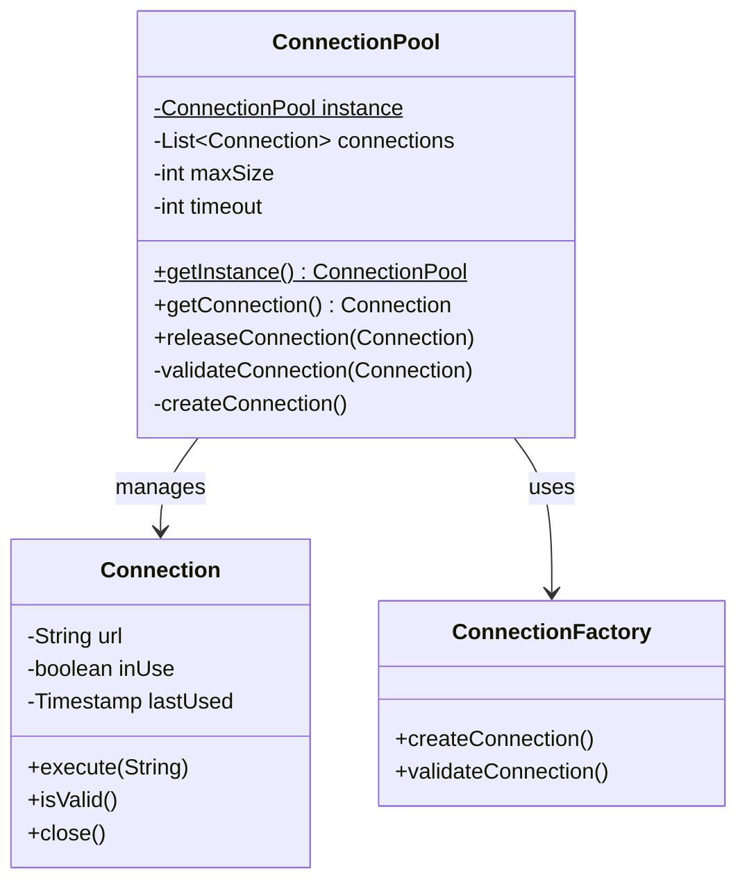

# Database Connection Pool

## Visão Geral

O projeto Database Connection Pool implementa um gerenciador de conexões de banco de dados utilizando o padrão Singleton combinado com Object Pool. Este sistema otimiza o uso de recursos e melhora a performance em aplicações com alto volume de operações de banco de dados.



## Implementação

### 1. Pool de Conexões

```java
public class ConnectionPool {
    private static volatile ConnectionPool instance;
    private final List<PooledConnection> connections;
    private final int maxSize;
    private final int timeout;
    private final ConnectionFactory factory;
    
    private ConnectionPool(ConnectionConfig config) {
        this.maxSize = config.getMaxSize();
        this.timeout = config.getTimeout();
        this.connections = new ArrayList<>();
        this.factory = new ConnectionFactory(config);
    }
    
    public static ConnectionPool getInstance(ConnectionConfig config) {
        if (instance == null) {
            synchronized (ConnectionPool.class) {
                if (instance == null) {
                    instance = new ConnectionPool(config);
                }
            }
        }
        return instance;
    }
    
    public synchronized Connection getConnection() throws ConnectionException {
        // Procura conexão disponível
        Optional<PooledConnection> availableConnection = connections.stream()
            .filter(conn -> !conn.isInUse() && conn.isValid())
            .findFirst();
            
        if (availableConnection.isPresent()) {
            PooledConnection connection = availableConnection.get();
            connection.setInUse(true);
            return connection;
        }
        
        // Cria nova conexão se não atingiu o limite
        if (connections.size() < maxSize) {
            PooledConnection connection = factory.createConnection();
            connections.add(connection);
            connection.setInUse(true);
            return connection;
        }
        
        throw new ConnectionException("Connection pool limit reached");
    }
    
    public synchronized void releaseConnection(Connection connection) {
        if (connection instanceof PooledConnection) {
            PooledConnection pooledConnection = (PooledConnection) connection;
            pooledConnection.setInUse(false);
            pooledConnection.setLastUsed(System.currentTimeMillis());
        }
    }
}
```

### 2. Conexão com Pool

```java
public class PooledConnection implements Connection {
    private final Connection delegate;
    private boolean inUse;
    private long lastUsed;
    private final int timeout;
    
    public PooledConnection(Connection delegate, int timeout) {
        this.delegate = delegate;
        this.timeout = timeout;
        this.lastUsed = System.currentTimeMillis();
    }
    
    public boolean isValid() {
        if (System.currentTimeMillis() - lastUsed > timeout) {
            return false;
        }
        try {
            return delegate.isValid(1);
        } catch (SQLException e) {
            return false;
        }
    }
    
    @Override
    public void close() {
        ConnectionPool.getInstance().releaseConnection(this);
    }
    
    // Delegação de outros métodos da interface Connection
}
```

### 3. Configuração

```java
public class ConnectionConfig {
    private final String url;
    private final String username;
    private final String password;
    private final int maxSize;
    private final int timeout;
    
    private ConnectionConfig(Builder builder) {
        this.url = builder.url;
        this.username = builder.username;
        this.password = builder.password;
        this.maxSize = builder.maxSize;
        this.timeout = builder.timeout;
    }
    
    public static class Builder {
        private String url;
        private String username;
        private String password;
        private int maxSize = 10;
        private int timeout = 30000;
        
        public Builder url(String url) {
            this.url = url;
            return this;
        }
        
        // Outros métodos builder...
        
        public ConnectionConfig build() {
            return new ConnectionConfig(this);
        }
    }
}
```

## Uso do Pool

```java
// Configuração
ConnectionConfig config = new ConnectionConfig.Builder()
    .url("jdbc:postgresql://localhost:5432/db")
    .username("user")
    .password("pass")
    .maxSize(20)
    .timeout(30000)
    .build();

// Obter instância do pool
ConnectionPool pool = ConnectionPool.getInstance(config);

// Usar conexão com try-with-resources
try (Connection conn = pool.getConnection()) {
    // Executar operações
    conn.prepareStatement("SELECT * FROM users").executeQuery();
} catch (SQLException e) {
    // Tratamento de erro
}
```

## Monitoramento

```java
public class PoolMonitor {
    private final ConnectionPool pool;
    
    public PoolStatistics getStatistics() {
        return new PoolStatistics(
            pool.getTotalConnections(),
            pool.getActiveConnections(),
            pool.getIdleConnections(),
            pool.getAverageWaitTime()
        );
    }
    
    public void logStatistics() {
        PoolStatistics stats = getStatistics();
        Logger.info("Pool Stats: active={}, idle={}, total={}, avgWait={}ms",
            stats.getActive(),
            stats.getIdle(),
            stats.getTotal(),
            stats.getAverageWaitTime());
    }
}
```

## Boas Práticas

1. **Thread Safety**
   - Use sincronização apropriada
   - Evite deadlocks
   - Implemente timeout para operações

2. **Gestão de Recursos**
   - Limite máximo de conexões
   - Timeout para conexões ociosas
   - Limpeza periódica de conexões inválidas

3. **Monitoramento**
   - Logging de operações importantes
   - Métricas de utilização
   - Alertas para situações críticas

## Desafios Comuns

1. **Vazamento de Conexões**
   - Use try-with-resources
   - Implemente timeout
   - Monitore conexões ativas

2. **Performance**
   - Balance o tamanho do pool
   - Otimize validação de conexões
   - Implemente cache de statements

3. **Escalabilidade**
   - Suporte múltiplos bancos
   - Configure por ambiente
   - Permita ajustes dinâmicos

## Testes

```java
@Test
public void testConnectionPool() {
    // Configurar
    ConnectionConfig config = new ConnectionConfig.Builder()
        .url("jdbc:h2:mem:testdb")
        .maxSize(5)
        .build();
    
    ConnectionPool pool = ConnectionPool.getInstance(config);
    
    // Testar obtenção de conexões
    List<Connection> connections = new ArrayList<>();
    for (int i = 0; i < 5; i++) {
        connections.add(pool.getConnection());
    }
    
    // Verificar limite
    assertThrows(ConnectionException.class, () -> {
        pool.getConnection();
    });
    
    // Liberar e reutilizar
    connections.get(0).close();
    assertNotNull(pool.getConnection());
}
```

## Próximos Passos

1. **Melhorias**
   - Implementar failover
   - Adicionar suporte a sharding
   - Otimizar performance

2. **Integrações**
   - Framework ORM
   - Sistema de métricas
   - Ferramentas de monitoramento

3. **Documentação**
   - JavaDoc completo
   - Guia de configuração
   - Exemplos de uso

## Recursos

- [HikariCP - Pool de Conexões](https://github.com/brettwooldridge/HikariCP)
- [Apache Commons DBCP](https://commons.apache.org/proper/commons-dbcp/)
- [Java JDBC Best Practices](https://www.oracle.com/technical-resources/articles/java/jdbc-best-practices.html)