# Ambiente de Desenvolvimento

```ascii
>> Iniciando configuração do ambiente...
>> Verificando dependências do sistema...
>> Preparando ferramentas de desenvolvimento...
>> Ambiente base estabelecido...
```

## Visão Geral

```mermaid
graph TD
    A[Sistema Operacional] --> B[JDK]
    B --> C[IDE]
    C --> D[Ferramentas Auxiliares]
    D --> E[Ambiente Completo]
    
    style A fill:#1a1a1a,stroke:#00ff00
    style B fill:#1a1a1a,stroke:#00ff00
    style C fill:#1a1a1a,stroke:#00ff00
    style D fill:#1a1a1a,stroke:#00ff00
    style E fill:#1a1a1a,stroke:#00ff00
```



## Stack de Desenvolvimento

### Componentes Essenciais
```ascii
AMBIENTE BASE
├── JDK 17+
├── IDE
│   ├── IntelliJ IDEA
│   ├── Eclipse
│   └── VS Code
├── Git
└── Terminal
```

### Ferramentas Auxiliares
```ascii
TOOLS
├── Maven/Gradle
├── Docker
├── Postman
└── DBeaver
```

## Configuração por Sistema Operacional

### Windows
```powershell
# Verificar versão do Java
java -version

# Verificar versão do Git
git --version

# Verificar variáveis de ambiente
echo %JAVA_HOME%
echo %PATH%
```

### macOS/Linux
```bash
# Verificar versão do Java
java -version

# Verificar versão do Git
git --version

# Verificar variáveis de ambiente
echo $JAVA_HOME
echo $PATH
```

## IDEs Recomendadas

### IntelliJ IDEA
- **Community Edition**
  - Gratuita
  - Recursos essenciais
  - Plugins básicos

- **Ultimate Edition**
  - Recursos avançados
  - Suporte a frameworks
  - Ferramentas profissionais

### VS Code
- Leve e rápido
- Extensível
- Multiplataforma
- Gratuito

### Eclipse
- IDE tradicional
- Grande comunidade
- Plugins diversos
- Gratuito

## Plugins Essenciais

### Para Produtividade
```ascii
PLUGINS
├── Code Completion
├── Git Integration
├── Code Analysis
└── Theme Tools
```

### Para Qualidade
```ascii
QUALITY
├── SonarLint
├── CheckStyle
├── PMD
└── SpotBugs
```

## Configurações Recomendadas

### Editor Settings
```json
{
    "editor.formatOnSave": true,
    "java.format.enabled": true,
    "java.completion.enabled": true,
    "java.debug.settings.hotCodeReplace": "auto"
}
```

### Git Config
```bash
git config --global user.name "Seu Nome"
git config --global user.email "seu@email.com"
git config --global core.editor "code --wait"
```

## Verificação do Ambiente

### Checklist de Instalação
- [ ] JDK instalado e configurado
- [ ] IDE instalada e configurada
- [ ] Git instalado e configurado
- [ ] Terminal configurado
- [ ] Plugins essenciais instalados

### Teste do Ambiente
```java
public class EnvironmentTest {
    public static void main(String[] args) {
        System.out.println("Java Version: " + 
            System.getProperty("java.version"));
        System.out.println("Java Home: " + 
            System.getProperty("java.home"));
        System.out.println("OS: " + 
            System.getProperty("os.name"));
    }
}
```

## Próximos Passos

1. [Configurar Sistema Operacional](os-setup.md)
2. [Explorar Ferramentas](tools-overview.md)
3. [Começar a Programar](java-basics.md)

## Troubleshooting

### Problemas Comuns
1. **Java não encontrado**
   - Verificar instalação
   - Conferir PATH
   - Reinstalar se necessário

2. **IDE não reconhece JDK**
   - Verificar configurações
   - Reconfigurar JAVA_HOME
   - Reinstalar JDK

3. **Git não configurado**
   - Executar configurações básicas
   - Verificar credenciais
   - Testar conexão com repositório

[Configurar Sistema Operacional](os-setup.md){.next-step}

---

> "Um ambiente bem configurado é como ter acesso direto à Matrix - tudo flui naturalmente."