# Encapsulamento

## Conceito Base

Encapsulamento é o princípio de ocultar detalhes internos e fornecer uma interface controlada para interação.

```mermaid
graph TD
    A[Classe] -->|protege| B[Dados Privados]
    A -->|expõe| C[Interface Pública]
    
    style A fill:#1a1a1a,stroke:#00ff00
    style B fill:#1a1a1a,stroke:#00ff00
    style C fill:#1a1a1a,stroke:#00ff00
```



## Implementação

```java
public class SecureDataVault {
    // Dados privados
    private String[] encryptedData;
    private int accessLevel;
    private boolean isLocked;

    // Interface pública
    public void storeData(String data) {
        if (!isLocked) {
            // Lógica de armazenamento
        }
    }

    public String retrieveData(int index) {
        if (validateAccess()) {
            return encryptedData[index];
        }
        return null;
    }

    private boolean validateAccess() {
        // Lógica de validação
        return accessLevel > 2;
    }
}
```

## Modificadores de Acesso

1. **private**
   - Acesso apenas na classe
   - Máxima proteção
   - Dados sensíveis

2. **protected**
   - Acesso na hierarquia
   - Classes derivadas
   - Pacote atual

3. **public**
   - Acesso universal
   - Interface externa
   - API pública

## Getters e Setters

```java
public class CyberAccount {
    private double credits;
    private String owner;

    // Getter
    public double getCredits() {
        return credits;
    }

    // Setter com validação
    public void setCredits(double amount) {
        if (amount >= 0) {
            this.credits = amount;
        }
    }
}
```

## Benefícios

1. **Segurança**
   - Controle de acesso
   - Validação de dados
   - Proteção de estado

2. **Manutenção**
   - Mudanças internas
   - Evolução segura
   - Debugging simples

3. **Flexibilidade**
   - Interface estável
   - Implementação variável
   - Versionamento

## Exercícios Práticos

```java
public class SecuritySystem {
    // Implemente:
    // 1. Dados privados
    // 2. Getters/Setters
    // 3. Validações
    // 4. Métodos de acesso
}
```

## Próximos Passos

[Herança](inheritance.md){.next-step}

> "Na matrix, a informação é poder. Proteja-a com encapsulamento."