# Tratamento de Erros em Java

O tratamento de erros é uma parte fundamental da programação em Java, permitindo que você lide com situações inesperadas de forma elegante e robusta.

## Por que o Tratamento de Erros é Importante?

```mermaid
graph TD
    A[Programa] --> B{Erro?}
    B -->|Sim| C[Tratamento de Erro]
    B -->|Não| D[Fluxo Normal]
    C --> E[Recuperação]
    C --> F[Log]
    C --> G[Feedback ao Usuário]
    
    style A fill:#1a1a1a,stroke:#00ff00
    style B fill:#1a1a1a,stroke:#ff3366
    style C fill:#1a1a1a,stroke:#33ccff
```



### Benefícios Principais

1. **Robustez**
   - Previne falhas catastróficas
   - Mantém o programa funcionando
   - Garante consistência dos dados

2. **Experiência do Usuário**
   - Mensagens de erro claras
   - Feedback apropriado
   - Recuperação graciosa

3. **Manutenibilidade**
   - Código mais organizado
   - Melhor depuração
   - Logs mais efetivos

## Conceitos Fundamentais

### Tipos de Erros

1. **Erros de Compilação**
   - Sintaxe incorreta
   - Tipos incompatíveis
   - Recursos não encontrados

2. **Erros de Runtime**
   - Divisão por zero
   - Null pointer
   - Array index out of bounds

3. **Erros Lógicos**
   - Bugs de negócio
   - Cálculos incorretos
   - Fluxos inesperados

### Hierarquia de Exceções

```java
try {
    // Código que pode gerar exceção
    riskyOperation();
} catch (Exception e) {
    // Tratamento do erro
    handleError(e);
} finally {
    // Código que sempre executa
    cleanup();
}
```

## Tópicos Principais

Este módulo abordará:

- [Exceções em Java](exceptions.md)
- [Try-Catch e Finally](try-catch.md)
- [Exceções Personalizadas](custom-exceptions.md)
- [Try-with-Resources](try-with-resources.md)

## Melhores Práticas

1. **Nunca Ignore Exceções**
   ```java
   try {
       // operação
   } catch (Exception e) {
       // NO MÍNIMO faça log do erro
       logger.error("Erro na operação", e);
   }
   ```

2. **Use Exceções Específicas**
   ```java
   try {
       // operação
   } catch (FileNotFoundException e) {
       // tratamento específico
   } catch (IOException e) {
       // tratamento mais genérico
   }
   ```

3. **Documente Exceções**
   ```java
   /**
    * @throws IllegalArgumentException se o valor for negativo
    */
   public void setValue(int value) {
       if (value < 0) {
           throw new IllegalArgumentException("Valor não pode ser negativo");
       }
   }
   ```

## Próximos Passos

- Explore os diferentes tipos de exceções
- Pratique criando exceções personalizadas
- Implemente tratamento de erros em seus projetos
- Aprenda sobre logging e debugging

## Recursos Adicionais

- [Java Exception Handling Tutorial](https://docs.oracle.com/javase/tutorial/essential/exceptions/)
- [Best Practices for Exception Handling](https://www.oracle.com/java/technologies/javase/exceptions.html)

> "Em um mundo perfeito, não precisaríamos de tratamento de erros. Mas no mundo real, ele é tão essencial quanto o próprio código."

[Começar com Exceções](exceptions.md){.next-step}