# Logger de Erros

## Visão Geral

```mermaid
graph TD
    A[Logger de Erros] --> B[Captura]
    A --> C[Formatação]
    A --> D[Persistência]
    
    B --> B1[Exceções]
    B --> B2[Contexto]
    B --> B3[Stack Trace]
    
    C --> C1[Estrutura]
    C --> C2[Níveis]
    C --> C3[Metadados]
    
    D --> D1[Arquivo]
    D --> D2[Banco]
    D --> D3[Serviço]
    
    style A fill:#1a1a1a,stroke:#00ff00
    style B fill:#1a1a1a,stroke:#33ccff
    style C fill:#1a1a1a,stroke:#33ccff
    style D fill:#1a1a1a,stroke:#33ccff
```



## Implementação Base

```java
public class ErrorLogger {
    private final Queue<LogEntry> logQueue;
    
    public void log(Exception e, String context) {
        // Implementação
    }
}
```

## Componentes Principais

### 1. LogEntry
- Timestamp do erro
- Tipo da exceção
- Mensagem detalhada
- Stack trace

### 2. LogProcessor
- Processamento assíncrono
- Formatação de mensagens
- Rotação de arquivos

### 3. LogPersistence
- Estratégias de armazenamento
- Políticas de retenção
- Compressão de logs

## Níveis de Log

1. **ERROR**
   - Erros críticos
   - Falhas de sistema
   - Exceções não tratadas

2. **WARN**
   - Situações inesperadas
   - Degradação de performance
   - Retry operations

3. **INFO**
   - Eventos importantes
   - Mudanças de estado
   - Operações principais

## Boas Práticas

1. **Performance**
   - Logging assíncrono
   - Buffer de mensagens
   - Compressão eficiente

2. **Organização**
   - Estrutura clara
   - Rotação de arquivos
   - Categorização

3. **Segurança**
   - Sanitização de dados
   - Controle de acesso
   - Backup regular

## Uso Prático

```java
ErrorLogger logger = new ErrorLogger();

try {
    // Operação que pode falhar
} catch (Exception e) {
    logger.log(e, "Contexto da operação");
}
```

## Formatos de Log

1. **JSON**
```json
{
    "timestamp": "2024-01-20T10:15:30",
    "level": "ERROR",
    "message": "Falha na operação",
    "stackTrace": "..."
}
```

2. **Text**
```text
[2024-01-20 10:15:30] ERROR: Falha na operação
Context: Processamento de pagamento
Stack: ...
```

## Monitoramento

1. **Métricas**
   - Taxa de erros
   - Tempo de processamento
   - Uso de recursos

2. **Alertas**
   - Thresholds
   - Notificações
   - Escalação

## Exercícios Práticos

1. **Implementar Rotação**
```java
public class LogRotator {
    public void rotate(String logFile) {
        // Implementar rotação
    }
}
```

2. **Criar Formatador**
```java
public class LogFormatter {
    public String format(LogEntry entry) {
        // Implementar formatação
    }
}
```

## Próximos Passos
- Implementar agregação de logs
- Adicionar análise em tempo real
- Criar dashboards
- Integrar com APM

[Próximo: Circuit Breaker](circuit-breaker.md){.next-step}