# Projetos de Tratamento de Erros

## Visão Geral

```mermaid
graph TD
    A[Projetos de Erros] --> B[Sistema de Validação]
    A --> C[Logger de Erros]
    A --> D[Circuit Breaker]
    
    B --> B1[Validadores]
    B --> B2[Regras]
    B --> B3[Feedback]
    
    C --> C1[Captura]
    C --> C2[Formatação]
    C --> C3[Persistência]
    
    D --> D1[Monitoramento]
    D --> D2[Fallback]
    D --> D3[Recuperação]
    
    style A fill:#1a1a1a,stroke:#00ff00
    style B fill:#1a1a1a,stroke:#33ccff
    style C fill:#1a1a1a,stroke:#33ccff
    style D fill:#1a1a1a,stroke:#33ccff
```

## Projetos Disponíveis

### 1. Sistema de Validação
- [Sistema de Validação](validation-system.md) - Sistema robusto de validação de dados
- Implementa diferentes tipos de validadores
- Fornece feedback detalhado sobre erros

### 2. Logger de Erros
- [Logger de Erros](error-logger.md) - Sistema avançado de logging
- Captura e formata exceções
- Persiste logs para análise posterior

### 3. Circuit Breaker
- [Circuit Breaker](circuit-breaker.md) - Padrão de resiliência
- Previne falhas em cascata
- Implementa estados e recuperação

## Conceitos Aplicados

1. **Tratamento de Exceções**
   - Try-catch blocks
   - Exceções personalizadas
   - Propagação de erros

2. **Validação de Dados**
   - Regras de negócio
   - Validação de entrada
   - Feedback ao usuário

3. **Logging**
   - Níveis de log
   - Formatação de mensagens
   - Rotação de arquivos

4. **Resiliência**
   - Estados do circuit breaker
   - Timeouts e retries
   - Fallback mechanisms

## Objetivos de Aprendizado

- Implementar tratamento robusto de erros
- Criar sistemas de validação flexíveis
- Desenvolver mecanismos de logging eficientes
- Construir aplicações resilientes

## Boas Práticas

1. **Validação**
   - Valide entrada no ponto mais próximo da origem
   - Forneça mensagens de erro claras
   - Mantenha validações consistentes

2. **Logging**
   - Use níveis apropriados de log
   - Inclua contexto relevante
   - Evite informações sensíveis

3. **Resiliência**
   - Implemente timeouts adequados
   - Prepare-se para falhas
   - Tenha estratégias de fallback

## Desafios Práticos

1. **Sistema de Validação**
   - Adicione novos tipos de validadores
   - Implemente validação assíncrona
   - Crie regras compostas

2. **Logger**
   - Implemente rotação de arquivos
   - Adicione formatação personalizada
   - Integre com sistemas externos

3. **Circuit Breaker**
   - Adicione métricas
   - Implemente recuperação gradual
   - Crie dashboard de monitoramento

## Próximos Passos
- Explore padrões avançados de resiliência
- Integre com frameworks de logging
- Implemente validação distribuída
- Adicione telemetria e monitoramento

## Recursos Adicionais
- [Java Exception Handling Best Practices](https://docs.oracle.com/javase/tutorial/essential/exceptions/)
- [Resilience4j Documentation](https://resilience4j.readme.io/)
- [SLF4J User Manual](http://www.slf4j.org/manual.html)

> "Um sistema robusto não é aquele que nunca falha, mas sim aquele que sabe lidar com as falhas de forma elegante."

[Começar com Sistema de Validação](validation-system.md){.next-step}