# Exceções em Java

## Hierarquia de Exceções

```mermaid
graph TD
    A[Throwable] --> B[Error]
    A --> C[Exception]
    C --> D[RuntimeException]
    C --> E[CheckedException]
    
    style A fill:#1a1a1a,stroke:#00ff00
    style B fill:#1a1a1a,stroke:#ff3366
    style C fill:#1a1a1a,stroke:#33ccff
```



## Tipos de Exceções

### 1. Checked Exceptions
- Verificadas em tempo de compilação
- Devem ser declaradas ou tratadas
- Exemplos: `IOException`, `SQLException`

```java
public void readFile() throws IOException {
    FileReader file = new FileReader("arquivo.txt");
    // código para ler arquivo
}
```

### 2. Unchecked Exceptions (RuntimeException)
- Não verificadas em tempo de compilação
- Geralmente indicam erros de programação
- Exemplos: `NullPointerException`, `ArrayIndexOutOfBoundsException`

```java
public void processArray(int[] array) {
    // Pode lançar NullPointerException ou ArrayIndexOutOfBoundsException
    int value = array[10];
}
```

### 3. Errors
- Problemas graves na JVM
- Não devem ser tratados pelo programa
- Exemplos: `OutOfMemoryError`, `StackOverflowError`

## Exceções Comuns

1. **NullPointerException**
```java
String str = null;
str.length(); // Lança NullPointerException
```

2. **ArrayIndexOutOfBoundsException**
```java
int[] array = new int[5];
array[10] = 1; // Lança ArrayIndexOutOfBoundsException
```

3. **IllegalArgumentException**
```java
public void setAge(int age) {
    if (age < 0) {
        throw new IllegalArgumentException("Idade não pode ser negativa");
    }
}
```

## Boas Práticas

1. **Seja Específico**
- Use exceções específicas em vez de genéricas
- Ajuda na identificação e tratamento do problema

2. **Documente as Exceções**
```java
/**
 * @throws IllegalArgumentException se o valor for negativo
 * @throws IOException em caso de erro de leitura
 */
public void processValue(int value) throws IOException {
    // implementação
}
```

3. **Mantenha a Granularidade**
- Lance exceções no nível mais baixo possível
- Trate no nível apropriado da aplicação

## Exemplos Práticos

### Exemplo 1: Validação de Entrada
```java
public class UserValidator {
    public void validateUsername(String username) {
        if (username == null || username.trim().isEmpty()) {
            throw new IllegalArgumentException("Username não pode ser vazio");
        }
        if (username.length() < 3) {
            throw new IllegalArgumentException("Username deve ter no mínimo 3 caracteres");
        }
    }
}
```

### Exemplo 2: Operações de Arquivo
```java
public class FileProcessor {
    public String readFile(String path) throws IOException {
        try (BufferedReader reader = new BufferedReader(new FileReader(path))) {
            return reader.readLine();
        }
    }
}
```

## Próximos Passos
- Aprenda sobre [Try-Catch e Finally](try-catch.md)
- Explore [Exceções Personalizadas](custom-exceptions.md)
- Estude [Try-with-Resources](try-with-resources.md)

## Recursos Adicionais
- [Java Exception Tutorial](https://docs.oracle.com/javase/tutorial/essential/exceptions/)
- [Java Exception Best Practices](https://www.oracle.com/java/technologies/javase/exceptions.html)