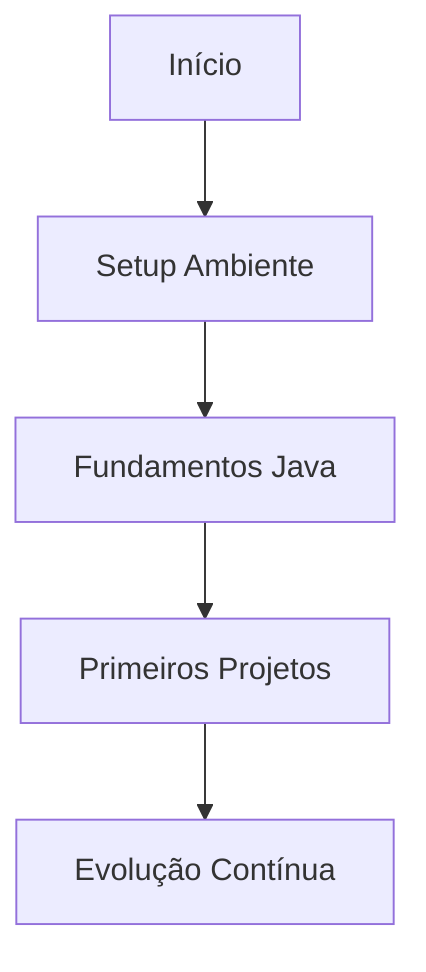

# Iniciando no NetRunner

```ascii
>> Inicializando sequência de boot...
>> Carregando módulos básicos...
>> Preparando ambiente de desenvolvimento...
>> Sistema pronto para upload inicial...
```

## Pré-requisitos do Sistema

### Hardware Recomendado
- Processador: Dual Core ou superior
- Memória RAM: 8GB mínimo (16GB recomendado)
- Armazenamento: 10GB de espaço livre
- Conexão com Internet estável

### Software Base
- Sistema Operacional: Windows 10/11, macOS, Linux
- Java Development Kit (JDK) 17 ou superior
- IDE compatível (recomendamos IntelliJ IDEA)
- Git para controle de versão

## Checklist de Inicialização

```ascii
CHECKLIST
├── [1] Configuração do Ambiente
├── [2] Instalação das Ferramentas
├── [3] Verificação do Sistema
└── [4] Teste de Conexão
```

## Sequência de Boot

### 1. Preparação Inicial
Antes de mergulhar no código, certifique-se de:
- Ler o [Sobre o Projeto](about.md)
- Verificar os [Pré-requisitos](prerequisites.md)
- Entender o [Caminho de Aprendizado](learning-path.md)

### 2. Setup do Ambiente
Configure seu ambiente de desenvolvimento:
- [Configuração do Sistema Operacional](os-setup.md)
- [Visão Geral das Ferramentas](tools-overview.md)

### 3. Primeiros Passos
```java
public class FirstConnection {
    public static void main(String[] args) {
        System.out.println("Conexão estabelecida com NetRunner...");
        System.out.println("Iniciando upload de conhecimento...");
        System.out.println("Bem-vindo à Matrix, runner!");
    }
}
```

## Roadmap Inicial



## Navegação do Sistema

### Estrutura do Curso
- Módulos progressivos
- Projetos práticos em cada seção
- Exercícios de fixação
- Desafios de código

### Como Progredir
1. Complete cada módulo sequencialmente
2. Execute todos os exemplos de código
3. Faça os exercícios propostos
4. Construa os projetos sugeridos

## Suporte e Recursos

### Canais de Ajuda
- Documentação oficial
- Fórum da comunidade
- Repositório de exemplos
- Canal de dúvidas

## Próximos Passos

Escolha seu caminho:

1. [Configurar Ambiente de Desenvolvimento](development-environment.md)
2. [Instalar JDK](jdk-installation.md)
3. [Configurar IDE](ide-setup.md)

## Dicas de Sobrevivência

> "Na Matrix do código, a prática constante é sua melhor arma."

- Mantenha um ritmo consistente de estudos
- Pratique diariamente
- Não pule etapas fundamentais
- Construa seu próprio código
- Participe da comunidade

## Checkpoint

Antes de prosseguir, certifique-se de:
- [ ] Ter lido a introdução completa
- [ ] Entender a estrutura do curso
- [ ] Verificar os requisitos do sistema
- [ ] Estar pronto para começar a configuração

[Começar Configuração do Ambiente](development-environment.md){.next-step}

---

> "Todo runner começa com um primeiro comando. Faça o seu contar."