# Herança

## Conceito Base

Herança permite que uma classe herde atributos e métodos de outra, estabelecendo uma relação "é um" entre classes.

```mermaid
graph TD
    A[Netrunner] -->|herda de| B[Hacker]
    B -->|herda de| C[CyberOperator]
    
    style A fill:#1a1a1a,stroke:#00ff00
    style B fill:#1a1a1a,stroke:#00ff00
    style C fill:#1a1a1a,stroke:#00ff00
```



## Implementação Básica

```java
public class CyberOperator {
    protected String codename;
    protected int accessLevel;

    public CyberOperator(String codename) {
        this.codename = codename;
        this.accessLevel = 1;
    }

    public void accessNetwork() {
        System.out.println("Basic network access");
    }
}

public class Hacker extends CyberOperator {
    private int hackingSkill;

    public Hacker(String codename) {
        super(codename);
        this.hackingSkill = 50;
    }

    @Override
    public void accessNetwork() {
        System.out.println("Advanced network access");
    }
}
```

## Tipos de Herança

### Herança Simples
```java
public class Netrunner extends Hacker {
    private String[] cyberdeckModules;
    
    public Netrunner(String codename) {
        super(codename);
        this.cyberdeckModules = new String[]{"Basic"};
    }
}
```

### Hierarquia de Classes
- Superclasse (pai)
- Subclasse (filho)
- Cadeia de herança

## Palavra-chave super

```java
public class ICEBreaker extends Netrunner {
    public ICEBreaker(String codename) {
        super(codename);  // Chama construtor pai
    }

    @Override
    public void accessNetwork() {
        super.accessNetwork();  // Chama método pai
        System.out.println("Breaking ICE protocols");
    }
}
```

## Boas Práticas

1. **Composição vs Herança**
   - Prefira composição
   - Evite hierarquias profundas
   - Mantenha coesão

2. **Princípio LSP**
   - Substituição de Liskov
   - Comportamento consistente
   - Contratos respeitados

3. **Documentação**
   - Documente extensões
   - Explique sobreposições
   - Defina contratos

## Exercícios Práticos

```java
// Implemente:
public class SecuritySystem {
    // Base para sistema de segurança
}

public class FirewallSystem extends SecuritySystem {
    // Sistema específico de firewall
}

public class IntrusionDetection extends SecuritySystem {
    // Sistema de detecção
}
```

## Próximos Passos

[Polimorfismo](polymorphism.md){.next-step}

> "Na hierarquia do código, cada classe herda o poder de seus ancestrais."