# Interfaces e Classes Abstratas

## Interfaces

### Definição Básica
```java
public interface CyberSystem {
    void initialize();
    void shutdown();
    boolean isRunning();
    
    default void restart() {
        shutdown();
        initialize();
    }
}
```

### Implementação Múltipla
```java
public interface Hackable {
    void breach();
    int getSecurityLevel();
}

public class SecurityGateway implements CyberSystem, Hackable {
    private boolean active;
    private int secLevel;

    @Override
    public void initialize() {
        active = true;
    }

    @Override
    public void shutdown() {
        active = false;
    }

    @Override
    public boolean isRunning() {
        return active;
    }

    @Override
    public void breach() {
        secLevel--;
    }

    @Override
    public int getSecurityLevel() {
        return secLevel;
    }
}
```

## Classes Abstratas

### Estrutura Base
```java
public abstract class NetworkNode {
    protected String id;
    protected boolean connected;

    public NetworkNode(String id) {
        this.id = id;
        this.connected = false;
    }

    public abstract void processData(byte[] data);
    
    public void connect() {
        connected = true;
    }
}
```

### Implementação Concreta
```java
public class DataNode extends NetworkNode {
    private DataProcessor processor;

    public DataNode(String id) {
        super(id);
        this.processor = new DataProcessor();
    }

    @Override
    public void processData(byte[] data) {
        if (connected) {
            processor.analyze(data);
        }
    }
}
```

## Comparação

### Interface vs Classe Abstrata

```mermaid
graph TD
    A[Interface] -->|Características| B[Múltipla implementação<br>Apenas assinaturas<br>Métodos default]
    C[Classe Abstrata] -->|Características| D[Herança única<br>Estado e comportamento<br>Construtor]
    
    style A fill:#1a1a1a,stroke:#00ff00
    style B fill:#1a1a1a,stroke:#00ff00
    style C fill:#1a1a1a,stroke:#00ff00
    style D fill:#1a1a1a,stroke:#00ff00
```



## Padrões de Uso

### Interface Funcional
```java
@FunctionalInterface
public interface DataFilter {
    boolean test(byte[] data);
    
    static DataFilter combine(DataFilter f1, DataFilter f2) {
        return data -> f1.test(data) && f2.test(data);
    }
}
```

### Template Method
```java
public abstract class CyberOperation {
    public final void execute() {
        preCheck();
        runOperation();
        postCheck();
    }

    protected abstract void runOperation();
    
    protected void preCheck() {
        // Implementação padrão
    }
    
    protected void postCheck() {
        // Implementação padrão
    }
}
```

## Exercícios Práticos

```java
// 1. Crie uma hierarquia de sistemas de segurança
public interface SecurityProtocol {
    void authenticate();
    void encrypt(byte[] data);
    void decrypt(byte[] data);
}

// 2. Implemente um sistema de logs abstrato
public abstract class LogSystem {
    // Implemente métodos comuns e abstratos
}

// 3. Desenvolva diferentes tipos de nós de rede
public interface NetworkComponent {
    // Defina operações de rede
}
```

## Boas Práticas

1. **Interface Segregation**
   - Interfaces pequenas e coesas
   - Foco em comportamento específico
   - Evite interfaces gordas

2. **Abstração Apropriada**
   - Use classes abstratas para código comum
   - Interfaces para contratos puros
   - Balanceie flexibilidade e complexidade

3. **Nomenclatura**
   - Interfaces: capacidade/comportamento
   - Classes abstratas: conceito base
   - Métodos: verbos/ações

## Próximos Passos

[Records](records.md){.next-step}

> "Na matrix digital, interfaces e abstrações são as ferramentas que moldam a realidade do código."