# Caminho de Aprendizado

```ascii
>> Inicializando mapa neural...
>> Carregando rotas de conhecimento...
>> Calculando trajetória ótima...
>> Caminho de desenvolvimento estabelecido...
```

## Roadmap de Evolução

```mermaid
graph TD
    A[Inicialização] --> B[Java Básico]
    B --> C[POO & Estruturas]
    C --> D[Recursos Avançados]
    D --> E[Frameworks & Tools]
    E --> F[Especialização]
    
    style A fill:#1a1a1a,stroke:#00ff00
    style B fill:#1a1a1a,stroke:#00ff00
    style C fill:#1a1a1a,stroke:#00ff00
    style D fill:#1a1a1a,stroke:#00ff00
    style E fill:#1a1a1a,stroke:#00ff00
    style F fill:#1a1a1a,stroke:#00ff00
```



## Níveis de Progressão

### Nível 1: Inicialização
```ascii
FASE INICIAL
├── Setup do Ambiente
├── Sintaxe Básica
├── Variáveis e Tipos
├── Operadores
└── Strings
```

### Nível 2: Controle de Fluxo
```ascii
CONTROLE
├── Condicionais
├── Loops
├── Switch
└── Pattern Matching
```

### Nível 3: Estruturas de Dados
```ascii
ESTRUTURAS
├── Arrays
├── Collections
├── Lists & Sets
└── Maps & Queues
```

### Nível 4: POO Fundamental
```ascii
ORIENTAÇÃO A OBJETOS
├── Classes e Objetos
├── Encapsulamento
├── Herança
└── Polimorfismo
```

### Nível 5: Recursos Avançados
```ascii
AVANÇADO
├── Generics
├── Lambda
├── Streams
└── Optional
```

## Metodologia de Progresso

### Ciclo de Aprendizado


## Sistema de Missões

### Projetos por Nível
1. **Básico**
   - Calculadora
   - Conversor de Temperatura
   - Manipulador de Strings

2. **Intermediário**
   - Sistema Bancário
   - Gerenciador de Tarefas
   - Processador de Dados

3. **Avançado**
   - API REST
   - Microserviço
   - Sistema Distribuído

## Métricas de Progresso

### Indicadores de Evolução
- Projetos completados
- Exercícios resolvidos
- Conceitos dominados
- Código revisado

### Sistema de Conquistas
```ascii
CONQUISTAS
├── Iniciante [▓▓▓▓▓░░░░░]
├── Desenvolvedor [▓▓▓░░░░░░░]
└── Especialista [▓░░░░░░░░░]
```

## Recursos de Suporte

### Material Complementar
- Documentação oficial
- Artigos técnicos
- Vídeos tutoriais
- Exercícios práticos

### Ferramentas de Desenvolvimento
- IDEs recomendadas
- Plugins essenciais
- Frameworks populares
- Bibliotecas úteis

## Próximas Etapas

### Caminhos de Especialização
1. Backend Development
2. Cloud Computing
3. Microservices
4. Data Engineering

## Dicas de Progresso

### Boas Práticas
- Code todos os dias
- Revise conceitos regularmente
- Participe da comunidade
- Construa projetos pessoais

### Armadilhas Comuns
- Pular fundamentos
- Não praticar código
- Ignorar boas práticas
- Evitar desafios

[Começar Jornada](java-basics.md){.next-step}

---

> "O caminho do conhecimento é como a Matrix - infinito em possibilidades, limitado apenas pela sua dedicação."