# Matrix Code Generator


{style="width:700px"}

O Matrix Code Generator é um projeto que simula o famoso "código digital" do filme Matrix, criando uma animação de caracteres em cascata no terminal.

## Visão Geral

```mermaid
graph TD
    A[Inicialização] --> B[Geração de Caracteres]
    B --> C[Animação]
    C --> D[Renderização]
    D --> C
    
    style A fill:#1a1a1a,stroke:#00ff00
    style B fill:#1a1a1a,stroke:#00ff00
    style C fill:#1a1a1a,stroke:#00ff00
    style D fill:#1a1a1a,stroke:#00ff00
```



## Implementação Base

```java
public class MatrixCodeGenerator {
    private static final int WIDTH = 80;
    private static final int HEIGHT = 24;
    private static final String CHARS = "ｱｲｳｴｵｶｷｸｹｺｻｼｽｾｿﾀﾁﾂﾃ1234567890";
    
    private char[][] matrix;
    private int[] drops;
    
    public MatrixCodeGenerator() {
        matrix = new char[HEIGHT][WIDTH];
        drops = new int[WIDTH];
        initializeMatrix();
    }
    
    private void initializeMatrix() {
        // Inicializa a matriz com espaços em branco
        for (int i = 0; i < HEIGHT; i++) {
            for (int j = 0; j < WIDTH; j++) {
                matrix[i][j] = ' ';
            }
        }
        
        // Inicializa as posições das gotas
        for (int i = 0; i < WIDTH; i++) {
            drops[i] = (int)(Math.random() * HEIGHT);
        }
    }
    
    public void update() {
        // Atualiza a posição das gotas
        for (int i = 0; i < WIDTH; i++) {
            // Gera um caractere aleatório
            char randomChar = CHARS.charAt(
                (int)(Math.random() * CHARS.length())
            );
            
            // Atualiza a posição
            matrix[drops[i]][i] = randomChar;
            
            // Move a gota para baixo
            drops[i]++;
            
            // Reseta a gota quando chega ao fim
            if (drops[i] >= HEIGHT) {
                drops[i] = 0;
            }
        }
    }
    
    public void render() {
        // Limpa a tela
        System.out.print("\033[H\033[2J");
        System.out.flush();
        
        // Renderiza a matriz
        for (int i = 0; i < HEIGHT; i++) {
            for (int j = 0; j < WIDTH; j++) {
                System.out.print(matrix[i][j]);
            }
            System.out.println();
        }
    }
}
```

## Conceitos Aplicados

### Manipulação de Arrays
- Arrays bidimensionais para representar a tela
- Arrays unidimensionais para controlar as "gotas"
- Iteração e atualização de elementos

### Caracteres e Strings
- Conjunto de caracteres especiais
- Manipulação de caracteres individuais
- Conversão entre tipos

### Controle de Fluxo
- Loops aninhados
- Condicionais
- Controle de posição

### Aleatoriedade
- Geração de números aleatórios
- Seleção aleatória de caracteres
- Posicionamento randômico

## Melhorias Sugeridas

### Efeitos Visuais
```java
public void addColorEffects() {
    // Códigos ANSI para cores
    String green = "\u001B[32m";
    String brightGreen = "\u001B[92m";
    String reset = "\u001B[0m";
    
    // Aplicar cores com base na posição
    // ...
}
```

### Velocidade Variável
```java
public void updateSpeed() {
    // Velocidade baseada na posição
    for (int i = 0; i < WIDTH; i++) {
        float speed = 1.0f + (float)Math.random();
        // Aplicar velocidade
        // ...
    }
}
```

## Desafios de Implementação

1. **Efeito de Fade**
   - Implementar degradê de cores
   - Criar rastro das gotas
   - Adicionar efeito de desvanecimento

2. **Interatividade**
   - Controles de usuário
   - Ajuste de velocidade em tempo real
   - Personalização de caracteres

3. **Otimização**
   - Gerenciamento de memória
   - Melhor performance
   - Suporte a diferentes tamanhos de tela

## Exemplo de Uso

```java
public class Main {
    public static void main(String[] args) {
        MatrixCodeGenerator matrix = new MatrixCodeGenerator();
        
        while (true) {
            matrix.update();
            matrix.render();
            
            try {
                Thread.sleep(100); // Controle de FPS
            } catch (InterruptedException e) {
                e.printStackTrace();
            }
        }
    }
}
```

## Dicas de Debug

- Use logging para rastrear o movimento das gotas
- Implemente modo de debug visual
- Adicione controles de pausa/resume

## Recursos Adicionais

### Bibliotecas Úteis
- [Lanterna](https://github.com/mabe02/lanterna) - TUI em Java
- [ANSI Escape Codes](https://en.wikipedia.org/wiki/ANSI_escape_code)
- [JLine](https://github.com/jline/jline3) - Terminal handling

### Referências
- [Console Colors in Java](https://stackoverflow.com/questions/5762491/how-to-print-color-in-console-using-system-out-println)
- [Terminal Animation Tutorial](https://www.baeldung.com/java-console-animation)
- [Unicode Character Table](https://unicode-table.com/en/)

## Próximos Passos

Após completar este projeto, você pode avançar para:
- [Cyber Deck Simulator](cyber-deck-simulator.md)
- [Data Encryptor](data-encryptor.md)

[Cyber Deck Simulator](cyber-deck-simulator.md){.next-step}

---

> "O código da Matrix está em todo lugar. Uma vez que você aprende a vê-lo, não há volta."