# Fundamentos da Programação Orientada a Objetos

## O que é OOP?

A Programação Orientada a Objetos (OOP) é um paradigma de programação que organiza o código em objetos, que contêm dados e código. Os objetos são instâncias de classes, que servem como blueprints para criar objetos.

## Pilares da OOP

```mermaid
graph TD
    A[OOP] --> B[Encapsulamento]
    A --> C[Herança]
    A --> D[Polimorfismo]
    A --> E[Abstração]
    
    style A fill:#1a1a1a,stroke:#00ff00
    style B fill:#1a1a1a,stroke:#00ff00
    style C fill:#1a1a1a,stroke:#00ff00
    style D fill:#1a1a1a,stroke:#00ff00
    style E fill:#1a1a1a,stroke:#00ff00
```



### Encapsulamento
- Oculta detalhes internos
- Protege dados sensíveis
- Reduz complexidade

### Herança
- Reutiliza código
- Estabelece hierarquias
- Especializa comportamentos

### Polimorfismo
- Flexibiliza interfaces
- Adapta comportamentos
- Simplifica código

### Abstração
- Modela conceitos
- Simplifica problemas
- Define interfaces

## Conceitos Fundamentais

### Classes e Objetos
```java
public class Netrunner {
    private String codename;
    private int skillLevel;

    public Netrunner(String codename) {
        this.codename = codename;
        this.skillLevel = 1;
    }
}
```

### Atributos e Métodos
```java
public class CyberDeck {
    // Atributos
    private int power;
    private String model;

    // Métodos
    public void upgrade() {
        this.power++;
    }
}
```

## Benefícios da OOP

1. **Manutenibilidade**
   - Código organizado
   - Fácil de atualizar
   - Modular

2. **Reusabilidade**
   - Componentes reutilizáveis
   - Menos duplicação
   - Economia de tempo

3. **Flexibilidade**
   - Fácil de estender
   - Adaptável
   - Escalável

4. **Segurança**
   - Controle de acesso
   - Dados protegidos
   - Código seguro

## Práticas Recomendadas

### Nomenclatura
- Classes: PascalCase
- Métodos: camelCase
- Variáveis: camelCase
- Constantes: UPPER_CASE

### Organização
- Uma classe por arquivo
- Pacotes lógicos
- Hierarquia clara

### Princípios
- Single Responsibility
- Open/Closed
- Liskov Substitution
- Interface Segregation
- Dependency Inversion

## Próximos Passos

1. Classes e Objetos
2. Encapsulamento
3. Herança
4. Polimorfismo
5. Interfaces e Classes Abstratas
6. Records
7. Sealed Classes
8. Projetos Práticos

## Conceitos Relacionados

- Design Patterns
- SOLID Principles
- Clean Code
- Refactoring
- Testing

[Classes e Objetos](classes-objects.md){.next-step}

> "Na Matrix da programação, objetos são as unidades fundamentais de poder. Domine-os, e você dominará o código."