# Projetos OOP

## Visão Geral

```mermaid
graph TD
    A[Projetos OOP] --> B[Sistema Bancário]
    A --> C[Hierarquia de Formas]
    A --> D[Sistema de Plugins]
    
    B --> B1[Contas]
    B --> B2[Transações]
    B --> B3[Segurança]
    
    C --> C1[Renderização]
    C --> C2[Cálculos]
    C --> C3[Transformações]
    
    D --> D1[Carregamento]
    D --> D2[Extensibilidade]
    D --> D3[Integração]
    
    style A fill:#1a1a1a,stroke:#00ff00
    style B fill:#1a1a1a,stroke:#33ccff
    style C fill:#1a1a1a,stroke:#33ccff
    style D fill:#1a1a1a,stroke:#33ccff
```



## Estrutura dos Projetos

```ascii
PROJETO
├── src/
│   ├── main/
│   │   └── java/
│   │       └── com/
│   │           └── netrunner/
│   │               └── project/
│   │                   ├── core/
│   │                   ├── model/
│   │                   ├── service/
│   │                   └── util/
│   └── test/
│       └── java/
└── README.md
```

## Sistema Bancário Digital

### Objetivos de Aprendizado
- Encapsulamento de dados sensíveis
- Herança para diferentes tipos de contas
- Polimorfismo em operações financeiras
- Interfaces para serviços bancários
- Records para transações imutáveis
- Classes seladas para hierarquia de contas

### Componentes Principais
```java
// Hierarquia de contas
public sealed abstract class Account 
    permits CheckingAccount, SavingsAccount, CryptoAccount {
    
    private final String id;
    private BigDecimal balance;
    private final SecurityModule security;
    
    // Métodos abstratos e concretos
}

// Transações imutáveis
public record Transaction(
    String id,
    BigDecimal amount,
    LocalDateTime timestamp,
    TransactionType type,
    String description
) {}

// Interface de serviços
public interface BankingService {
    void processTransaction(Transaction tx);
    Account getAccount(String id);
    List<Transaction> getHistory(String accountId);
}
```

## Hierarquia de Formas

### Objetivos de Aprendizado
- Abstração de formas geométricas
- Herança para especialização
- Polimorfismo em renderização
- Interfaces para comportamentos
- Records para pontos e dimensões
- Classes seladas para tipos de formas

### Componentes Principais
```java
// Ponto imutável
public record Point(double x, double y) {
    public double distanceTo(Point other) {
        // Cálculo de distância
    }
}

// Hierarquia de formas
public sealed interface Shape 
    permits Circle, Rectangle, Triangle {
    
    double area();
    double perimeter();
    void render(Graphics g);
    boolean contains(Point p);
}

// Transformações
public interface Transformable {
    void rotate(double angle);
    void scale(double factor);
    void translate(Point delta);
}
```

## Sistema de Plugins

### Objetivos de Aprendizado
- Interfaces para extensibilidade
- Carregamento dinâmico
- Gerenciamento de dependências
- Padrão Observer para eventos
- Records para configurações
- Classes seladas para tipos de plugins

### Componentes Principais
```java
// Configuração de plugin
public record PluginConfig(
    String name,
    String version,
    Set<String> dependencies,
    Map<String, String> settings
) {}

// Interface base de plugin
public sealed interface Plugin 
    permits SecurityPlugin, NetworkPlugin, DataPlugin {
    
    void initialize(PluginConfig config);
    void start();
    void stop();
    String getStatus();
}

// Gerenciador de plugins
public class PluginManager {
    private final Map<String, Plugin> plugins;
    private final DependencyResolver resolver;
    
    public void loadPlugin(String path) {
        // Carregamento dinâmico
    }
}
```

## Desafios Extras

### Sistema Bancário
- Implementar criptografia de dados
- Adicionar autenticação biométrica
- Criar sistema de alertas
- Implementar transações programadas
- Adicionar suporte multi-moeda

### Hierarquia de Formas
- Implementar formas 3D
- Adicionar animações
- Criar sistema de colisões
- Implementar exportação SVG
- Adicionar efeitos visuais

### Sistema de Plugins
- Implementar hot-reload
- Adicionar versionamento
- Criar marketplace
- Implementar sandbox
- Adicionar telemetria

## Dicas de Implementação

1. **Planejamento**
   - Comece com diagramas UML
   - Identifique abstrações
   - Defina interfaces claras

2. **Desenvolvimento**
   - Use TDD
   - Refatore frequentemente
   - Documente decisões

3. **Testes**
   - Cubra casos de borda
   - Teste integrações
   - Valide segurança

## Próximos Passos

[Sistema Bancário](banking-system.md){.next-step}

> "Na Matrix do código orientado a objetos, cada projeto é uma oportunidade de criar um universo digital coerente e extensível."