# Sistema de Plugins

## Visão Geral
Este projeto implementa um sistema de plugins básico usando Java, demonstrando conceitos fundamentais de programação orientada a objetos e estruturas de dados básicas.

```mermaid
graph TD
    A[PluginSystem] --> B[Plugin]
    B --> C[name]
    B --> D[commands]
    B --> E[isEnabled]
    A --> F[plugins array]
    
    style A fill:#1a1a1a,stroke:#00ff00
    style B fill:#1a1a1a,stroke:#33ccff
    style F fill:#1a1a1a,stroke:#ff3366
```



## Componentes Principais

### Classe Plugin
A classe `Plugin` representa um plugin individual no sistema:

```java
public class Plugin {
    private String name;
    private boolean isEnabled;
    private String[] commands;

    // Construtor e métodos principais
    public Plugin(String name, String[] commands) {
        this.name = name;
        this.isEnabled = false;
        this.commands = commands;
    }

    public void enable() {
        isEnabled = true;
    }

    public void disable() {
        isEnabled = false;
    }

    public void executeCommand(String command) {
        // Executa um comando se o plugin estiver ativado
    }
}
```

### Sistema de Gerenciamento
A classe `PluginSystem` gerencia todos os plugins:

```java
public class PluginSystem {
    private Plugin[] plugins;
    private int pluginCount;
    private static final int MAX_PLUGINS = 10;

    public void addPlugin(Plugin plugin) {
        // Adiciona um novo plugin ao sistema
    }

    public void enablePlugin(String name) {
        // Ativa um plugin específico
    }

    public void disablePlugin(String name) {
        // Desativa um plugin específico
    }

    public void executeCommand(String pluginName, String command) {
        // Executa um comando em um plugin específico
    }
}
```

## Funcionalidades Principais

1. **Gerenciamento de Plugins**
   - Adicionar plugins
   - Ativar/desativar plugins
   - Listar plugins instalados

2. **Sistema de Comandos**
   - Cada plugin possui seus próprios comandos
   - Verificação de comandos disponíveis
   - Execução segura de comandos

3. **Estado dos Plugins**
   - Controle de estado (ativado/desativado)
   - Verificação antes da execução
   - Feedback de operações

## Exemplo de Uso

```java
// Criar sistema de plugins
PluginSystem system = new PluginSystem();

// Criar um plugin de calculadora
Plugin calculadora = new Plugin("Calculadora", 
    new String[]{"somar", "subtrair", "multiplicar"});

// Adicionar ao sistema
system.addPlugin(calculadora);

// Ativar o plugin
system.enablePlugin("Calculadora");

// Executar um comando
system.executeCommand("Calculadora", "somar");
```

## Exercícios Práticos

1. **Plugin Básico**
   - Crie um novo plugin com comandos personalizados
   - Implemente a lógica de execução dos comandos
   - Teste a ativação e desativação

2. **Sistema de Plugins**
   - Adicione múltiplos plugins ao sistema
   - Gerencie as interações entre plugins
   - Implemente listagem de plugins

3. **Comandos Personalizados**
   - Crie comandos com parâmetros
   - Implemente validação de comandos
   - Adicione feedback de execução

## Boas Práticas

1. **Organização do Código**
   - Mantenha métodos curtos e focados
   - Use nomes descritivos para variáveis
   - Comente seções importantes do código

2. **Validação**
   - Verifique estados antes de executar ações
   - Valide entradas de usuário
   - Forneça feedback claro

3. **Manutenção**
   - Mantenha o código organizado
   - Documente funcionalidades
   - Teste todas as operações

## Próximos Passos
- Adicione mais tipos de plugins
- Implemente sistema de configuração
- Crie uma interface de usuário simples
- Adicione persistência de dados

## Recursos Adicionais
- [Documentação Java](https://docs.oracle.com/javase/tutorial/)
- [Boas Práticas de Programação](https://www.oracle.com/java/technologies/javase/codeconventions.html)
