# Polimorfismo

## Conceito Base

Polimorfismo permite que objetos de diferentes classes sejam tratados como objetos de uma classe comum, possibilitando comportamentos diferentes através da mesma interface.

```mermaid
graph TD
    A[CyberProgram] -->|executa como| B[Virus]
    A -->|executa como| C[Firewall]
    A -->|executa como| D[DataMiner]
    
    style A fill:#1a1a1a,stroke:#00ff00
    style B fill:#1a1a1a,stroke:#00ff00
    style C fill:#1a1a1a,stroke:#00ff00
    style D fill:#1a1a1a,stroke:#00ff00
```



## Tipos de Polimorfismo

### Sobrescrita (Override)
```java
public class CyberProgram {
    public void execute() {
        System.out.println("Running base program");
    }
}

public class Virus extends CyberProgram {
    @Override
    public void execute() {
        System.out.println("Infiltrating system");
    }
}
```

### Sobrecarga (Overload)
```java
public class DataMiner {
    public void mine(String data) {
        // Processa string
    }

    public void mine(byte[] data) {
        // Processa bytes
    }

    public void mine(String data, int depth) {
        // Processa com profundidade
    }
}
```

## Polimorfismo em Ação

```java
public class SystemInterface {
    public void executeProgram(CyberProgram program) {
        program.execute();  // Polimorfismo em tempo de execução
    }

    public static void main(String[] args) {
        SystemInterface system = new SystemInterface();
        
        CyberProgram virus = new Virus();
        CyberProgram firewall = new Firewall();
        
        system.executeProgram(virus);    // Executa como Virus
        system.executeProgram(firewall); // Executa como Firewall
    }
}
```

## Benefícios

1. **Flexibilidade**
   - Código genérico
   - Extensibilidade
   - Manutenibilidade

2. **Reutilização**
   - Interfaces comuns
   - Comportamento variável
   - Código limpo

3. **Abstração**
   - Simplificação
   - Encapsulamento
   - Modularidade

## Padrões Comuns

### Factory Method
```java
public interface CyberTool {
    void activate();
}

public class ToolFactory {
    public CyberTool createTool(String type) {
        return switch (type) {
            case "hack" -> new HackTool();
            case "scan" -> new ScanTool();
            default -> throw new IllegalArgumentException();
        };
    }
}
```

### Strategy Pattern
```java
public interface AttackStrategy {
    void execute();
}

public class CyberAttack {
    private AttackStrategy strategy;
    
    public void setStrategy(AttackStrategy strategy) {
        this.strategy = strategy;
    }
    
    public void execute() {
        strategy.execute();
    }
}
```

## Exercícios Práticos

```java
// Implemente diferentes tipos de programas:
public interface Program {
    void run();
    void stop();
    String getStatus();
}

// Crie implementações para:
// 1. DataAnalyzer
// 2. NetworkScanner
// 3. SecurityMonitor
```

## Próximos Passos

[Interfaces e Classes Abstratas](interfaces-abstract.md){.next-step}

> "No ciberespaço, um programa pode assumir muitas formas. O poder está na adaptação."