# Records

## Conceito Base

Records são classes imutáveis que atuam como portadores transparentes de dados, introduzidos no Java 16.

```mermaid
graph TD
    A[Record] -->|Gera automaticamente| B[Constructor]
    A -->|Gera automaticamente| C[Getters]
    A -->|Gera automaticamente| D[equals/hashCode]
    A -->|Gera automaticamente| E[toString]
    
    style A fill:#1a1a1a,stroke:#00ff00
    style B fill:#1a1a1a,stroke:#00ff00
    style C fill:#1a1a1a,stroke:#00ff00
    style D fill:#1a1a1a,stroke:#00ff00
    style E fill:#1a1a1a,stroke:#00ff00
```



## Sintaxe Básica

```java
public record NetrunnerCredentials(
    String handle,
    byte[] biometricHash,
    int clearanceLevel
) {}

// Uso
var creds = new NetrunnerCredentials("Phantom", 
    "bio123".getBytes(), 
    5);

System.out.println(creds.handle());        // Getter automático
System.out.println(creds.clearanceLevel()); // Getter automático
```

## Características Principais

### Imutabilidade
```java
public record SecurityToken(
    String id,
    long timestamp,
    Set<String> permissions
) {
    // Construtor canônico validador
    public SecurityToken {
        // Cria cópia defensiva imutável
        permissions = Set.copyOf(permissions);
    }
}
```

### Métodos Adicionais
```java
public record DataPacket(
    byte[] payload,
    String destination,
    int priority
) {
    // Método instance
    public boolean isHighPriority() {
        return priority > 5;
    }

    // Método static
    public static DataPacket createEmergency(String dest) {
        return new DataPacket(new byte[0], dest, 10);
    }
}
```

## Casos de Uso

### DTOs (Data Transfer Objects)
```java
public record UserProfile(
    String id,
    String nickname,
    int reputationScore,
    LocalDateTime lastLogin
) {}

public record NetworkStatus(
    boolean connected,
    int latency,
    List<String> activeNodes
) {}
```

### Value Objects
```java
public record IpAddress(String address) {
    public IpAddress {
        if (!isValid(address)) {
            throw new IllegalArgumentException("Invalid IP");
        }
    }

    private static boolean isValid(String addr) {
        // Validação de IP
        return addr.matches("^(?:[0-9]{1,3}\\.){3}[0-9]{1,3}$");
    }
}
```

## Interoperabilidade

### Com Interfaces
```java
public interface Traceable {
    String getIdentifier();
}

public record TraceRoute(
    String source,
    String destination,
    List<String> hops
) implements Traceable {
    @Override
    public String getIdentifier() {
        return source + "->" + destination;
    }
}
```

### Com Pattern Matching
```java
public void processData(Object data) {
    if (data instanceof DataPacket(var payload, var dest, var priority)) {
        System.out.printf("Packet to %s with priority %d%n", 
            dest, priority);
    }
}
```

## Boas Práticas

1. **Uso Apropriado**
   - Para dados imutáveis
   - Para transferência de dados
   - Para objetos de valor

2. **Validação**
   - No construtor canônico
   - Cópias defensivas
   - Invariantes de negócio

3. **Limitações**
   - Não podem estender classes
   - Sempre são final
   - Campos sempre são final

## Exercícios Práticos

```java
// 1. Crie um record para configurações
public record SystemConfig(
    int maxConnections,
    Duration timeout,
    Set<String> allowedIPs
) {
    // Adicione validações
}

// 2. Implemente um record para métricas
public record NetworkMetrics(
    long bytesTransferred,
    int activeConnections,
    double throughput
) {
    // Adicione métodos úteis
}

// 3. Desenvolva um record para eventos
public record SecurityEvent(
    String eventId,
    LocalDateTime timestamp,
    String description,
    SecurityLevel level
) {
    // Implemente lógica adicional
}
```

## Próximos Passos

[Sealed Classes](sealed-classes.md){.next-step}

> "Records: quando seus dados precisam ser tão transparentes quanto o vidro e tão imutáveis quanto a lei da física digital."