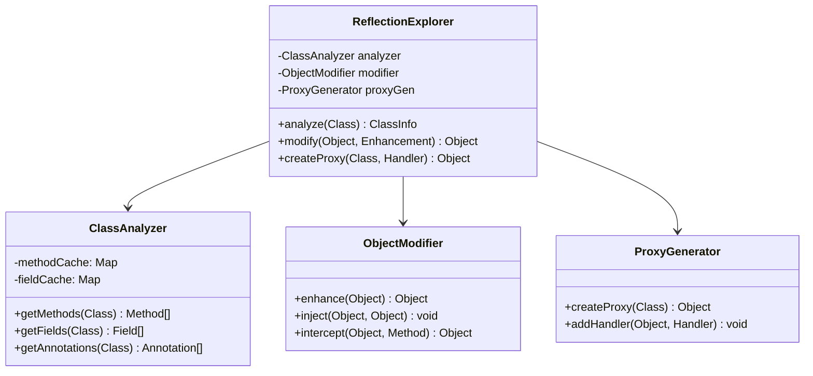

# Reflection Explorer


{style="width:700px"}

## Visão Geral do Projeto

O Reflection Explorer é uma ferramenta avançada para análise e manipulação de classes Java em runtime, permitindo:
- Inspeção detalhada de classes
- Modificação dinâmica de objetos
- Geração de proxies
- Análise de dependências
- Visualização de hierarquias

## Arquitetura



## Implementação Core

### Analisador de Classes
```java
public class ClassAnalyzer {
    private final Map<Class<?>, Method[]> methodCache = new ConcurrentHashMap<>();
    private final Map<Class<?>, Field[]> fieldCache = new ConcurrentHashMap<>();
    
    @Inspect
    public ClassInfo analyze(Class<?> target) {
        return ClassInfo.builder()
            .name(target.getName())
            .methods(getMethods(target))
            .fields(getFields(target))
            .annotations(getAnnotations(target))
            .superclass(target.getSuperclass())
            .interfaces(target.getInterfaces())
            .modifiers(target.getModifiers())
            .build();
    }
    
    private Method[] getMethods(Class<?> clazz) {
        return methodCache.computeIfAbsent(clazz, Class::getDeclaredMethods);
    }
    
    private Field[] getFields(Class<?> clazz) {
        return fieldCache.computeIfAbsent(clazz, Class::getDeclaredFields);
    }
}
```

### Modificador de Objetos
```java
public class ObjectModifier {
    @Modify
    public Object enhance(
        @Target Object instance,
        @Enhancement Enhancement enhancement
    ) {
        Class<?> clazz = instance.getClass();
        
        // Aplicar modificações
        for (Field field : clazz.getDeclaredFields()) {
            if (enhancement.shouldModify(field)) {
                field.setAccessible(true);
                field.set(instance, enhancement.getNewValue(field));
            }
        }
        
        return instance;
    }
    
    @Intercept
    public Object interceptMethod(
        Object instance,
        Method method,
        Object[] args,
        MethodHandler handler
    ) throws Exception {
        // Pré-processamento
        handler.beforeInvocation(method, args);
        
        // Invocação do método
        Object result = method.invoke(instance, args);
        
        // Pós-processamento
        return handler.afterInvocation(method, result);
    }
}
```

### Gerador de Proxy
```java
public class ProxyGenerator {
    public <T> T createProxy(
        Class<T> interfaceType,
        InvocationHandler handler
    ) {
        return (T) Proxy.newProxyInstance(
            interfaceType.getClassLoader(),
            new Class<?>[] { interfaceType },
            handler
        );
    }
    
    public class LoggingHandler implements InvocationHandler {
        private final Object target;
        
        public LoggingHandler(Object target) {
            this.target = target;
        }
        
        @Override
        public Object invoke(
            Object proxy,
            Method method,
            Object[] args
        ) throws Throwable {
            System.out.println("Before: " + method.getName());
            Object result = method.invoke(target, args);
            System.out.println("After: " + method.getName());
            return result;
        }
    }
}
```

## Recursos Avançados

### Visualizador de Hierarquia
```java
public class HierarchyVisualizer {
    public String generateDotGraph(Class<?> rootClass) {
        StringBuilder dot = new StringBuilder();
        dot.append("digraph Hierarchy {\n");
        
        // Adiciona nós
        addClassNode(dot, rootClass);
        
        // Adiciona relacionamentos
        addRelationships(dot, rootClass);
        
        dot.append("}");
        return dot.toString();
    }
    
    private void addClassNode(StringBuilder dot, Class<?> clazz) {
        dot.append(String.format(
            "  %s [label=\"%s\"];\n",
            clazz.getSimpleName(),
            clazz.getName()
        ));
    }
}
```

### Cache Inteligente
```java
public class ReflectionCache {
    private static final Map<Class<?>, ClassInfo> CLASS_INFO_CACHE = 
        new ConcurrentHashMap<>();
    
    public static ClassInfo getClassInfo(Class<?> clazz) {
        return CLASS_INFO_CACHE.computeIfAbsent(
            clazz,
            ReflectionCache::analyzeClass
        );
    }
    
    private static ClassInfo analyzeClass(Class<?> clazz) {
        // Análise detalhada da classe
        return new ClassAnalyzer().analyze(clazz);
    }
}
```

## Exemplos de Uso

### Análise de Dependências
```java
public class DependencyAnalyzer {
    public Set<Class<?>> findDependencies(Class<?> targetClass) {
        Set<Class<?>> dependencies = new HashSet<>();
        
        // Analisa campos
        for (Field field : targetClass.getDeclaredFields()) {
            dependencies.add(field.getType());
        }
        
        // Analisa métodos
        for (Method method : targetClass.getDeclaredMethods()) {
            dependencies.addAll(Arrays.asList(method.getParameterTypes()));
            dependencies.add(method.getReturnType());
        }
        
        return dependencies;
    }
}
```

### Injeção Dinâmica
```java
public class DependencyInjector {
    public void inject(Object instance) {
        Class<?> clazz = instance.getClass();
        
        for (Field field : clazz.getDeclaredFields()) {
            if (field.isAnnotationPresent(Inject.class)) {
                field.setAccessible(true);
                field.set(instance, createDependency(field.getType()));
            }
        }
    }
}
```

## Testes

### Testes Unitários
```java
@Test
public void testClassAnalysis() {
    ClassAnalyzer analyzer = new ClassAnalyzer();
    ClassInfo info = analyzer.analyze(TestClass.class);
    
    assertNotNull(info);
    assertEquals("TestClass", info.getName());
    assertTrue(info.getMethods().length > 0);
}

@Test
public void testObjectModification() {
    ObjectModifier modifier = new ObjectModifier();
    TestClass instance = new TestClass();
    
    Enhancement enhancement = new Enhancement("value", "newValue");
    Object modified = modifier.enhance(instance, enhancement);
    
    assertEquals("newValue", ((TestClass)modified).getValue());
}
```

## Considerações de Performance

1. **Caching**
   - Cache de reflection metadata
   - Reutilização de instâncias
   - Lazy loading de informações

2. **Otimizações**
   - Batch processing
   - Minimizar reflection em loops
   - Usar streams para processamento paralelo

3. **Memória**
   - Limpeza periódica de cache
   - Weak references para objetos
   - Pooling de instâncias comuns

## Próximos Passos

1. Implementar visualização gráfica
2. Adicionar suporte a bytecode manipulation
3. Criar sistema de plugins
4. Integrar com IDEs populares

## Recursos Adicionais

- [Java Reflection API Documentation](https://docs.oracle.com/javase/8/docs/api/java/lang/reflect/package-summary.html)
- [ASM Library](https://asm.ow2.io/)
- [ByteBuddy](https://bytebuddy.net/)

[Annotation Processor](annotation-processor.md){.next-step}