# Sealed Classes

## Conceito Base

Sealed Classes controlam a hierarquia de herança, permitindo apenas classes específicas como subclasses.

```mermaid
graph TD
    A[Sealed Class/Interface] -->|permits| B[Subclasse 1]
    A -->|permits| C[Subclasse 2]
    A -->|permits| D[Subclasse 3]
    
    style A fill:#1a1a1a,stroke:#00ff00
    style B fill:#1a1a1a,stroke:#00ff00
    style C fill:#1a1a1a,stroke:#00ff00
    style D fill:#1a1a1a,stroke:#00ff00
```



## Sintaxe Básica

```java
public sealed interface CyberwareComponent 
    permits NeuralImplant, BiometricEnhancer, CombatModule {
    
    void initialize();
    int getPowerConsumption();
}

public final class NeuralImplant implements CyberwareComponent {
    @Override
    public void initialize() {
        // Implementação
    }

    @Override
    public int getPowerConsumption() {
        return 50;
    }
}

public non-sealed class BiometricEnhancer 
    implements CyberwareComponent {
    // Implementação
}

public sealed class CombatModule implements CyberwareComponent 
    permits RangedModule, MeleeModule {
    // Implementação
}
```

## Modificadores de Permissão

### final
```java
public sealed class SecurityProtocol 
    permits BiometricAuth, TokenAuth {
    // Base implementation
}

public final class BiometricAuth extends SecurityProtocol {
    // Não pode ser estendida
}
```

### non-sealed
```java
public sealed interface DataProcessor 
    permits StreamProcessor, BatchProcessor {
    void process(byte[] data);
}

public non-sealed class StreamProcessor 
    implements DataProcessor {
    // Pode ser estendida por qualquer classe
}
```

### sealed
```java
public sealed interface NetworkNode 
    permits Router, Switch, Firewall {
    void connect();
    void disconnect();
}

public sealed class Router implements NetworkNode 
    permits CoreRouter, EdgeRouter {
    // Implementação
}
```

## Pattern Matching

```java
public String analyzeComponent(CyberwareComponent component) {
    return switch (component) {
        case NeuralImplant n -> 
            "Neural Implant: Power=" + n.getPowerConsumption();
        case BiometricEnhancer b -> 
            "Biometric: Power=" + b.getPowerConsumption();
        case CombatModule c -> 
            "Combat: Power=" + c.getPowerConsumption();
    };
}
```

## Casos de Uso

### Hierarquia de Comandos
```java
public sealed interface Command 
    permits QueryCommand, UpdateCommand, DeleteCommand {
    void execute();
}

public final class QueryCommand implements Command {
    private final String query;
    
    @Override
    public void execute() {
        // Implementação
    }
}
```

### Sistema de Plugins
```java
public sealed interface Plugin 
    permits SecurityPlugin, NetworkPlugin, DataPlugin {
    void load();
    void unload();
    String getVersion();
}
```

## Boas Práticas

1. **Hierarquia Clara**
   - Defina hierarquias explícitas
   - Limite extensibilidade apropriadamente
   - Documente o propósito de cada permissão

2. **Escolha de Modificadores**
   - Use `final` para folhas da hierarquia
   - Use `non-sealed` para pontos de extensão
   - Use `sealed` para controle intermediário

3. **Pattern Matching**
   - Aproveite o pattern matching exaustivo
   - Combine com records quando apropriado
   - Mantenha switches concisos

## Exercícios Práticos

```java
// 1. Sistema de Protocolos de Rede
public sealed interface NetworkProtocol 
    permits TCP, UDP, ICMP {
    void sendPacket(byte[] data);
    void receivePacket();
}

// 2. Hierarquia de Eventos
public sealed class SystemEvent 
    permits UserEvent, NetworkEvent, SecurityEvent {
    private final LocalDateTime timestamp;
    // Implementação
}

// 3. Framework de Processamento
public sealed interface DataProcessor 
    permits RealTimeProcessor, BatchProcessor {
    void process(List<byte[]> data);
    ProcessingStats getStats();
}
```

## Próximos Passos

[Projetos OOP](oop-projects.md){.next-step}

> "Em um mundo digital sem fronteiras, sealed classes são as muralhas que protegem sua hierarquia de código."