# Hierarquia de Formas Geométricas

## Visão Geral
Este projeto implementa um sistema de formas geométricas usando conceitos avançados de Programação Orientada a Objetos em Java.

```mermaid
graph TD
    A[Shape] --> B[Circle]
    A --> C[Rectangle]
    A --> D[Triangle]
    E[Point] --> B
    E --> C
    E --> D
    
    style A fill:#1a1a1a,stroke:#00ff00
    style B fill:#1a1a1a,stroke:#33ccff
    style C fill:#1a1a1a,stroke:#33ccff
    style D fill:#1a1a1a,stroke:#33ccff
    style E fill:#1a1a1a,stroke:#ff3366
```



## Conceitos Demonstrados
- Classes seladas (sealed classes)
- Records para dados imutáveis
- Herança e polimorfismo
- Classes e métodos abstratos
- Encapsulamento
- Geometria computacional

## Estrutura do Projeto

### Classe Base: Shape
```java
public sealed abstract class Shape permits Circle, Rectangle, Triangle {
    private Point position;
    private String color;
    
    // Métodos abstratos que todas as formas devem implementar
    public abstract double area();
    public abstract double perimeter();
    public abstract boolean contains(Point point);
}
```

### Record Point
```java
public record Point(double x, double y) {
    public double distanceTo(Point other) {
        double dx = this.x - other.x;
        double dy = this.y - other.y;
        return Math.sqrt(dx * dx + dy * dy);
    }
}
```

## Implementações

### Circle
- Usa um ponto central e raio
- Área: πr²
- Perímetro: 2πr
- Contém ponto: distância ao centro ≤ raio

### Rectangle
- Definido por ponto superior esquerdo, largura e altura
- Área: largura × altura
- Perímetro: 2(largura + altura)
- Contém ponto: verifica coordenadas x,y dentro dos limites

### Triangle
- Definido por três pontos
- Área: Fórmula de Heron
- Perímetro: soma das distâncias entre pontos
- Contém ponto: coordenadas baricêntricas

## Exemplo de Uso

```java
// Criar formas
Circle circle = new Circle(new Point(0, 0), 5, "red");
Rectangle rectangle = new Rectangle(new Point(2, 2), 4, 3, "blue");
Triangle triangle = new Triangle(
    new Point(0, 0),
    new Point(3, 0),
    new Point(0, 4),
    "green"
);

// Array polimórfico
Shape[] shapes = {circle, rectangle, triangle};

// Operações com formas
for (Shape shape : shapes) {
    System.out.println("Área: " + shape.area());
    System.out.println("Perímetro: " + shape.perimeter());
}
```

## Exercícios Práticos

1. **Extensão Básica**
   - Adicione uma nova forma (ex: Hexágono)
   - Implemente rotação para as formas
   - Adicione cálculo de escala

2. **Funcionalidades Avançadas**
   - Detecção de colisão entre formas
   - Transformações geométricas
   - Serialização de formas

3. **Interface Gráfica**
   - Renderização das formas
   - Interface para criar/editar formas
   - Animações de movimento

## Desafios

1. **Otimização**
   - Melhore o algoritmo de verificação de ponto em triângulo
   - Implemente cache para cálculos frequentes
   - Otimize operações em lote

2. **Extensibilidade**
   - Adicione sistema de eventos
   - Implemente padrão Observer
   - Crie sistema de plugins

## Dicas de Implementação

1. **Precisão Numérica**
   - Use `double` para cálculos geométricos
   - Considere tolerância em comparações
   - Implemente arredondamento adequado

2. **Boas Práticas**
   - Valide parâmetros nos construtores
   - Mantenha imutabilidade onde possível
   - Use nomes descritivos

3. **Testes**
   - Teste casos limites
   - Verifique formas degeneradas
   - Valide transformações

## Recursos Adicionais

- [Geometria Computacional](https://www.geeksforgeeks.org/computational-geometry-introduction/)
- [Java Graphics2D](https://docs.oracle.com/javase/tutorial/2d/index.html)
- [Matemática para Programadores](https://www.mathsisfun.com/geometry/index.html)

## Próximos Passos
- Explore padrões de design relacionados
- Implemente persistência de dados
- Adicione suporte a formas compostas