# Sistema de Validação

## Visão Geral

```mermaid
graph TD
    A[Sistema de Validação] --> B[Validadores]
    A --> C[Resultados]
    A --> D[Feedback]
    
    B --> B1[Tipo Dados]
    B1 --> B11[String]
    B1 --> B12[Número]
    B1 --> B13[Data]
    
    B --> B2[Regras]
    B2 --> B21[Tamanho]
    B2 --> B22[Formato]
    B2 --> B23[Range]
    
    C --> C1[Sucesso]
    C --> C2[Falha]
    C --> C3[Erros]
    
    D --> D1[Mensagens]
    D --> D2[Códigos]
    D --> D3[Detalhes]
    
    style A fill:#1a1a1a,stroke:#00ff00
    style B fill:#1a1a1a,stroke:#33ccff
    style C fill:#1a1a1a,stroke:#33ccff
    style D fill:#1a1a1a,stroke:#33ccff
```



## Implementação Base

```java
public class ValidationSystem {
    private final List<Validator> validators;
    
    public ValidationResult validate(Object data) {
        // Implementação
    }
}
```

## Componentes Principais

### 1. Interface Validator
- Define contrato para validadores
- Método principal de validação
- Retorno padronizado

### 2. ValidationResult
- Status da validação
- Lista de erros
- Mensagens detalhadas

### 3. ValidationBuilder
- Construção fluente
- Encadeamento de validações
- Composição de regras

## Uso Prático

```java
ValidationSystem validator = new ValidationSystem();
validator.addValidator(new EmailValidator());
validator.addValidator(new PasswordValidator());

ValidationResult result = validator.validate(userData);
if (!result.isValid()) {
    System.out.println(result.getErrors());
}
```

## Tipos de Validadores

1. **Dados Básicos**
   - String (comprimento, formato)
   - Números (range, precisão)
   - Datas (formato, período)

2. **Regras de Negócio**
   - Validações compostas
   - Dependências entre campos
   - Regras customizadas

3. **Validações Assíncronas**
   - Consultas externas
   - Verificações em banco
   - APIs de terceiros

## Boas Práticas

1. **Desempenho**
   - Cache de resultados
   - Validação lazy
   - Otimização de regras

2. **Manutenibilidade**
   - Validadores isolados
   - Regras reutilizáveis
   - Documentação clara

3. **Usabilidade**
   - Mensagens claras
   - Feedback imediato
   - Sugestões de correção

## Exercícios Práticos

1. **Validador de Formulário**
```java
public class FormValidator extends Validator {
    @Override
    public ValidationResult validate(Object data) {
        // Implementar validação
    }
}
```

2. **Validador de Documentos**
```java
public class DocumentValidator extends Validator {
    @Override
    public ValidationResult validate(Object data) {
        // Implementar validação
    }
}
```

## Próximos Passos
- Implementar novos validadores
- Adicionar suporte a anotações
- Criar validações customizadas
- Integrar com frameworks

[Próximo: Logger de Erros](error-logger.md){.next-step}