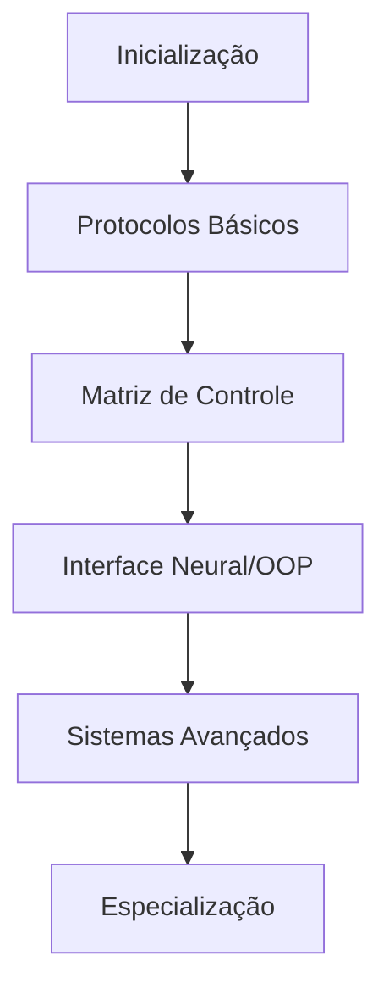

# NetRunner: Java Mastery Guide

## Inicializando Sistema...

```ascii
 _   _      _   ____                            
| \ | | ___| |_|  _ \ _   _ _ __  _ __   ___ _ __ 
|  \| |/ _ \ __| |_) | | | | '_ \| '_ \ / _ \ '__|
| |\  |  __/ |_|  _ <| |_| | | | | | | |  __/ |   
|_| \_|\___|\__|_| \_\\__,_|_| |_|_| |_|\___|_|   
                                                  
>> Java Mastery Guide v1.0
>> Inicializando interface neural...
>> Estabelecendo conexão com a Matrix...
>> Sistema pronto para upload de conhecimento...
```

## Sobre este Guia

Bem-vindo, runner. Você acaba de acessar a interface neural mais avançada para dominar a linguagem Java. Este não é apenas mais um tutorial - é sua porta de entrada para o submundo do desenvolvimento de software.

### O que você vai encontrar aqui

- 🔧 **Fundamentos Sólidos**: Do básico ao avançado, construa uma base inquebrável
- 🌐 **Projetos Práticos**: Aplique seus conhecimentos em missões do mundo real
- 🚀 **Tecnologias Modernas**: Frameworks, cloud, segurança e muito mais
- 💡 **Padrões e Boas Práticas**: Aprenda a construir código resiliente e escalável

## Pré-requisitos

- Computador com acesso à internet
- Vontade de aprender e experimentar
- Disposição para desafios práticos
- Mente aberta para novos conceitos

## Como Usar este Guia

1. **Siga a Sequência**: Os módulos foram organizados em ordem progressiva de complexidade
2. **Pratique**: Complete as missões práticas em cada seção
3. **Experimente**: Modifique os exemplos e crie suas próprias variações
4. **Conecte-se**: Participe da comunidade e compartilhe seu progresso

## Roadmap de Aprendizado



## Quick Start

```java
public class NetRunner {
    public static void main(String[] args) {
        System.out.println("Iniciando jornada no NetRunner...");
        System.out.println("Preparando ambiente de desenvolvimento...");
        System.out.println("Sistema pronto para começar!");
    }
}
```

## Próximos Passos

1. Comece pela seção [Sobre o Projeto](about.md)
2. Configure seu [Ambiente de Desenvolvimento](development-environment.md)
3. Inicie sua jornada com [Java Básico](java-basics.md)

## Status do Projeto

- Versão: 1.0
- Status: Ativo
- Java: 17+

---

> "O código é apenas o começo. O verdadeiro poder está em como você o utiliza." - NetRunner's Manifesto

[Começar Agora](getting-started.md)