```mermaid
graph TD
    A[Node] --> B[Node]
    style A fill:#1a1a1a,stroke:#00ff00
    style B fill:#1a1a1a,stroke:#00ff00
```

# Guia de Estilo para Documentação

## Estrutura Base dos Tópicos

```ascii
TÓPICO
|-- Título Principal
|-- Banner/Imagem Conceitual
|-- Descrição Breve
|-- Diagrama de Arquitetura
|-- Componentes Principais
|   |-- Explicação Técnica
|   |-- Exemplos de Código
|   `-- Diagramas/Visualizações
|-- Implementação Base
|-- Interface (quando aplicável)
|-- Desafios de Extensão
|-- Próximos Passos
|-- Conceitos Aplicados
|-- Dicas de Implementação
`-- Exercícios Propostos
```

## Elementos Visuais

### Banners e Imagens
- Dimensão padrão: 700px de largura
- Estilo: Cyberpunk/Neon
- Formato: PNG com fundo transparente
- Sintaxe:
```markdown

{style="width:700px"}
```

### Diagramas Mermaid
- Cores: Neon sobre fundo escuro
- Estilo minimalista
- Sintaxe:
```markdown

```

## Formatação de Texto

### Títulos
```markdown
# Título Principal
## Seção Principal
### Subseção
#### Tópico Específico
```

### Listas
- Não numeradas para itens sem ordem específica
- Numeradas para sequências ou passos

```markdown
- Item não ordenado
- Outro item
  - Sub-item
  - Sub-item

1. Passo um
2. Passo dois
   1. Sub-passo
   2. Sub-passo
```

### Código

#### Inline
- Use backticks para código inline: `System.out.println()`

#### Blocos de Código
```markdown
```java
public class Example {
    // Código aqui
}
```
```

### Tabelas
```markdown
| Coluna 1 | Coluna 2 |
|----------|----------|
| Valor 1  | Valor 2  |
```

## Elementos de Navegação

### Links Internos
```markdown
[Nome do Link](arquivo.md)
```

### Links "Próximo Passo"
```markdown
[Nome do Próximo Tópico](proximo-topico.md){.next-step}
```

## Tom e Linguagem

### Estilo de Escrita
- Direto e técnico
- Preciso e conciso
- Profissional mas acessível
- Sem emojis ou linguagem informal

### Exemplos
- Sempre práticos e aplicáveis
- Progressivamente complexos
- Comentados adequadamente
- Focados no conceito atual

## Padrões de Nomenclatura

### Arquivos
- Nomes em minúsculas
- Palavras separadas por hífen
- Extensão .md
- Exemplo: `cache-implementation.md`

### Seções de Código
- CamelCase para classes
- camelCase para métodos e variáveis
- UPPER_CASE para constantes

## Estrutura de Commits

### Mensagens
```
topic: breve descrição da alteração

- Detalhamento se necessário
- Múltiplas linhas se preciso
```

## Validação de Conteúdo

### Checklist
- [ ] Segue estrutura base
- [ ] Inclui todos elementos visuais necessários
- [ ] Código está formatado corretamente
- [ ] Links funcionam
- [ ] Progressão lógica do conteúdo
- [ ] Exemplos são práticos e claros
- [ ] Exercícios são relevantes
- [ ] Tom está consistente
- [ ] Formatação está correta

## Exemplos de Uso

### Título e Descrição
```markdown
# Implementação de Cache


{style="width:700px"}

Um sistema de cache é uma estrutura de dados que armazena 
temporariamente dados frequentemente acessados para melhorar 
a performance.
```

### Seção de Código
```markdown
## Implementação Base

```java
public class Example {
    private final int MAX_SIZE = 100;
    
    public void method() {
        // Implementação
    }
}
```
```

### Diagrama
```markdown
## Arquitetura do Sistema

```mermaid
graph TD
    A[Cliente] --> B[Sistema]
    style A fill:#1a1a1a,stroke:#00ff00
    style B fill:#1a1a1a,stroke:#00ff00
```


```

## Notas Finais
- Mantenha consistência em todo documento
- Siga a progressão do curso
- Foque em clareza e precisão
- Mantenha o estilo cyberpunk
- Atualize este guia conforme necessário