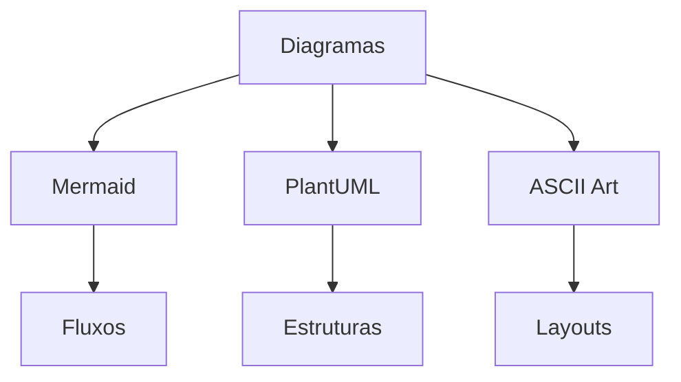
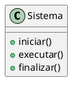

# Guia de Estilo: Documentação Cyberpunk

## Estrutura Base
```ascii
DOCUMENTO
|-- CONTEÚDO PRINCIPAL
|   |-- Explicação Técnica
|   |-- Exemplos Práticos
|   `-- Diagramas/Visualizações
|
|-- LABORATÓRIOS
|   |-- Objetivos
|   `-- Procedimentos
|
`-- EXERCÍCIOS
    |-- Desafios
    `-- Missões
```

## Diretrizes de Escrita

### Tom e Estilo
- Manter linguagem técnica e precisa
- Incorporar elementos cyberpunk na narrativa
- Ser direto e conciso, sem perder detalhamento
- Evitar emojis e linguagem informal

### Detalhamento Técnico
- Explicar conceitos em profundidade
- Incluir exemplos práticos
- Documentar edge cases
- Fornecer contexto técnico completo

### Elementos Visuais


### Formatação de Conteúdo
- Usar headers hierárquicos
- Incluir blocos de código comentados
- Adicionar notas e avisos importantes
- Manter consistência na formatação

### Elementos Obrigatórios
1. Descrição técnica detalhada
2. Exemplos práticos
3. Dicas e recomendações
4. Diagramas explicativos
5. Referências técnicas

### Seções Separadas
- Laboratórios em arquivos dedicados
- Exercícios em diretório próprio
- Links cruzados entre conteúdo relacionado

### Tom Narrativo
```ascii
TÉCNICO <---------------------> CYBERPUNK
Preciso                        Imersivo
Detalhado                      Envolvente
Acadêmico                      Narrativo
```

### Exemplos de Formatação

#### Descrição Técnica
```
[PROTOCOLO-01] Inicialização de Sistema
----------------------
Descrição detalhada do processo de bootstrap,
incluindo sequência de carregamento e 
verificações de integridade.
```

#### Dicas e Recomendações
```
[ALERTA] Otimização de Performance
----------------------------------
- Monitore uso de memória
- Implemente cache quando necessário
- Verifique pontos de contenção
```

#### Diagramas
